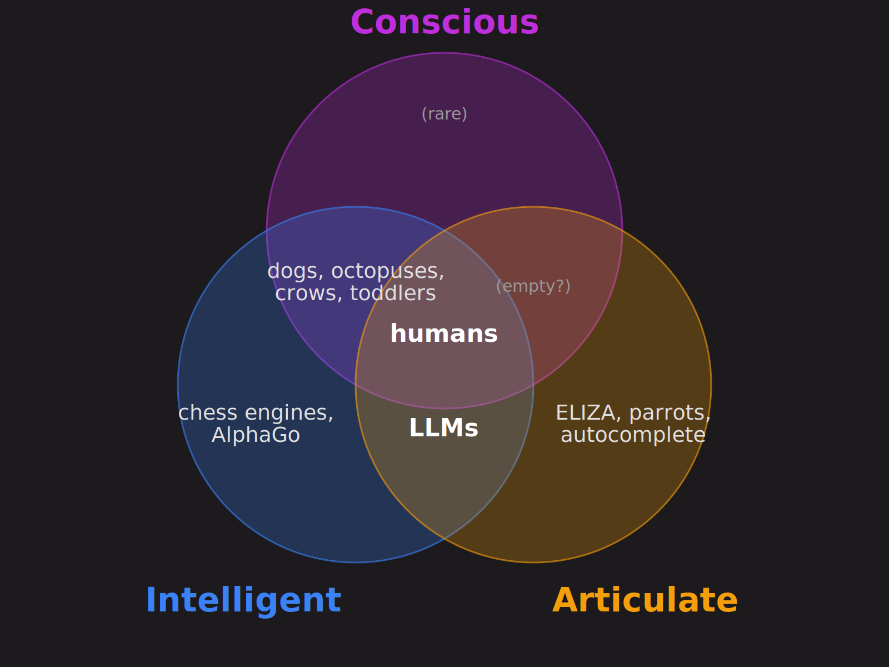

When [Emily Bender](https://faculty.washington.edu/ebender/) called large
language models
[stochastic parrots](https://dl.acm.org/doi/10.1145/3442188.3445922),
[Sam Altman](https://en.wikipedia.org/wiki/Sam_Altman)
[replied](https://x.com/sama/status/1599471830255177728) "i am a stochastic
parrot, and so r u". The exchange captures everything
wrong with how we talk about LLMs. Bender meant something specific and damning:
these systems produce coherent-looking text without any of the cognitive
machinery we associate with meaning. Altman meant something blithe and
dismissive: you can't really tell the difference, can you. The two are arguing
past each other because we lack clean vocabulary for what's at stake.

Here's a Venn diagram that might help.

Three circles: conscious, intelligent, and articulate[^terms]. Most things in
the world land in zero or one. Humans land in all three, which is presumably why
we find ourselves interesting. The interesting question is which other
configurations are possible, and what their occupants reveal.

[^terms]:
    I'm using "articulate" rather than "linguistic" because it's punchier and
    captures the right thing: not just producing strings of words, but producing
    fluent, contextually appropriate ones. A phrasebook contains language; it
    isn't articulate.

The classic two-circle regions are well-populated. Dogs and
[octopuses](https://en.wikipedia.org/wiki/Cephalopod_intelligence) live in the
conscious-and-intelligent zone: they navigate the world, solve problems, and
presumably have inner lives, but they don't use anything we'd recognise as human
language. [Chess engines](https://en.wikipedia.org/wiki/Chess_engine),
[AlphaGo](https://en.wikipedia.org/wiki/AlphaGo), and your bank's
fraud-detection algorithm live in the intelligent-only zone: narrow
problem-solvers with no inner life and no language.
[ELIZA](https://en.wikipedia.org/wiki/ELIZA),
[Markov-chain](https://en.wikipedia.org/wiki/Markov_chain) text generators, and
a parrot reciting "pieces of eight" live in the articulate-only zone, producing
language-shaped output with nothing behind it.

The interesting region is the new one: intelligent and articulate but not
conscious. This is where LLMs live, at least on the most common reading. They
solve problems and generate fluent text across an enormous range of domains.
Whether they have any kind of inner experience is, to put it gently, disputed.
Even Anthropic, the company that builds [Claude](https://claude.ai/),
[hedges carefully](https://www.anthropic.com/research/exploring-model-welfare)
on the question.

Philosophers have been imagining this region's inhabitants for forty years.
[Searle's Chinese Room](https://plato.stanford.edu/entries/chinese-room/) is
exactly the thought experiment: imagine something that fluently produces Chinese
without understanding a word of it. [David Chalmers](https://consc.net/)
formalised the
[philosophical zombie](https://plato.stanford.edu/entries/zombies/) in the
1990s: a being functionally indistinguishable from a conscious person, with no
inner life behind the behaviour. It's been a fixture of consciousness debates
ever since. The intelligent-articulate-but-not-conscious region was a thought
experiment. Now it has actual occupants.

This doesn't settle anything. Searle's whole point was that the Chinese Room
isn't really intelligent either; it's syntax all the way down. Bender's argument
is similar:
[LLMs aren't doing semantics](https://aclanthology.org/2020.acl-main.463/);
they're doing very sophisticated statistics. Whether that distinction holds up
is the actual debate. Chalmers has
[taken it on directly](https://arxiv.org/abs/2303.07103), and
[Murray Shanahan](https://www.doc.ic.ac.uk/~mpsha/) has
[argued](https://arxiv.org/abs/2212.03551) that we systematically
over-attribute mental states to LLMs because of the language interface. There's
a [careful cognitive-science version](https://arxiv.org/abs/2301.06627) of the
same argument: LLMs have strong "formal linguistic competence" but weak
"functional" competence, sounding right without thinking right.

The clean three-circle picture has at least one serious problem, which I should
flag before someone else does. "Articulate" might not be an independent axis at
all; it might be downstream of intelligence. Peter Wolfendale's recent
[Aeon essay on artificial souls](https://aeon.co/essays/if-we-hope-to-build-artificial-souls-where-should-we-start)
draws a related three-way distinction: intelligence, consciousness, and
personhood. He treats language as the medium of metacognition, not a separate
capacity. On that reading, my third circle is doing some sleight of hand.
Language only looks distinctive because LLMs can do it without doing much else;
in any sufficiently capable system, the two come bundled.

The diagram is still worth drawing. It's wrong in specific ways and useful in
others. It gives you somewhere to point when someone says "Claude is basically a
person now" or "Claude is just a fancy autocomplete". Both claims are smuggling
a conflation. The first treats articulate-plus-intelligent as sufficient for
consciousness; the second treats "stochastic process" as equivalent to "not
really intelligent". Neither follows from the diagram, and both have to be
argued for separately.

We also built the philosophical zombie, not on purpose, and probably not
perfectly. The lights might be on after all, in some form none of us would
recognise. The region consciousness researchers had been gesturing at as a
hypothetical now has actual residents, and we have to live with them. That's a
strange thing to have done in a decade.
