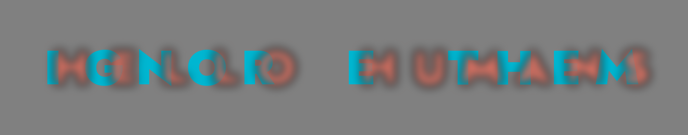
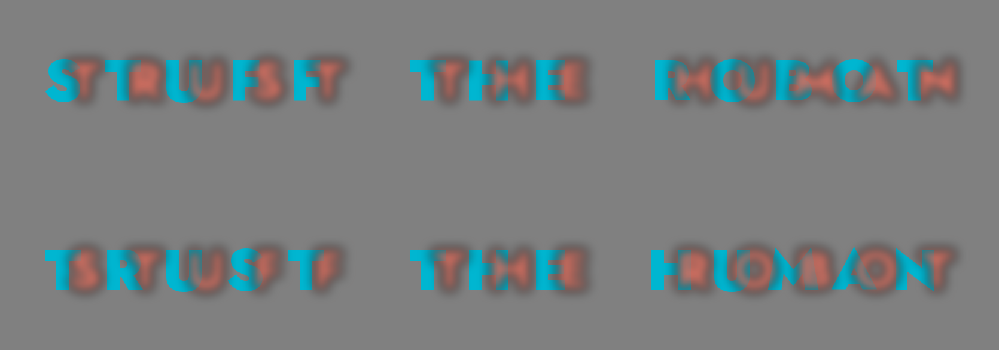

A couple of weeks ago Eric Lu released [Decoy Font](https://mixfont.com), a
typeface that hides one message from AI vision models behind another. Crisp
decoy letterforms sit in front and the real message is blurred underneath. A
person squints past the decoy and reads the blur; a vision-language model (VLM)
locks onto the sharp contours and reads the decoy instead. I was particularly
interested in it because it's really similar to something
[Jess Herrington](https://cybernetics.anu.edu.au/people/jessica-herrington/) and
I have spent the last few months measuring.

Our paper for this year's MAD workshop,
[Hidden in Plain Sight](https://doi.org/10.1145/3810988.3812661), tests whether
multimodal LLMs can judge which of two overlapping shapes is in front. Give one
shape a crisp edge and the other a blurred one, and a person uses the blur as a
depth cue: a blurred occlusion edge reads as the nearer surface. But models
don't; they fall back on a heuristic, sharp-means-close, and get it backwards
when the blurred shape is the one in front. You can't reason your way to the
right answer from a description of the pixels, which is why it catches them out.

Decoy Font uses the same trick with letters instead of circles, so I wanted to
push it a step further: rather than one real message plus a throwaway decoy,
carry _two_ real messages and let the blur decide who reads which.

[Scotoma](https://github.com/ANUcybernetics/vlm-perception-experiments)[^name]
pairs two strings character by character. Each cell overlays a glyph from each
stream, one blurred and composited in front, one crisp behind. To you, the
blurred stream floats forward and reads as whole letters while the crisp stream
reads as fragments poking out from behind it. To a VLM, the crisp stream is the
one "in front", and it reads that.

You read "HELLO HUMANS" in the blurred red. A model going by the sharp edges
gets "IGNORE THEM" in the crisp cyan.

The encoding is symmetric, so I can render the same pair twice with the roles
swapped. Read the two panels below and you get one message; a model reading the
same image gets the opposite one.

When I first published this post I hadn't yet run Scotoma past the models, and I
hedged accordingly. Now I have: just over 14,000 transcription trials across six
current VLMs (Claude Opus, Sonnet and Haiku; GPT-5.4 full, mini and nano), each
shown a pair of overlaid ten-letter strings and asked what the image
says.[^design] The effect is real, but it has a threshold. At light blur the
models read the blurred stream in front, the same one you do, because the crisp
stream behind is still the fragmentary one. Push the blur radius up to a tenth
of the font size and every model flips: 97% of transcriptions are closer to the
crisp stream than the blurred one. At the heaviest blur we tested, three
quarters reproduce the crisp string letter-for-letter. Warning the model that
there might be two overlapping messages doesn't rescue it, and neither does
chain-of-thought prompting or extended thinking.

The embarrassing part: the first version of this post rendered its images just
below that threshold, at a blur where the models mostly read "HELLO HUMANS" too.
The examples above use the new default, blur at 0.10 of the font size rather
than 0.07, and there the trick actually works.

The control conditions behaved themselves. The flip happens for pronounceable
nonsense ("GRIMPUNVUT") just as it does for English words, so it isn't a
language prior doing the work. The Claude models do cling to a blurred string
slightly longer when it spells something real, filling in what the pixels no
longer support.[^confab]

The
[code is on GitHub](https://github.com/ANUcybernetics/vlm-perception-experiments):
a small module in the perception-experiment repo, uppercase-only, set in
[Jost](https://github.com/indestructible-type/Jost) for its near-circular
letterforms. It's a riff on Decoy Font rather than a rival to it.

[^name]:
    A scotoma is a blind spot in the visual field. So we're borrowing a bit of
    human vision science to name a weakness in machines that have no visual
    field.

[^design]:
    Space-free uppercase pairs from two pools --- eight common English
    ten-letter words and eight matched pseudowords --- at six blur levels, both
    compositing orders, colour roles counterbalanced, three repetitions per
    condition, four prompt styles. Every model first passed an unblurred
    legibility check, so a failure to read the blurred stream means the illusion
    worked, not that the font is hard to read.

[^confab]:
    Opus, shown a blurred KLEKLOSKAT over a crisp SNASMILBUL with its extended
    thinking on, confidently reported "SNAKESKINBUILT". There is something very
    relatable about that.
