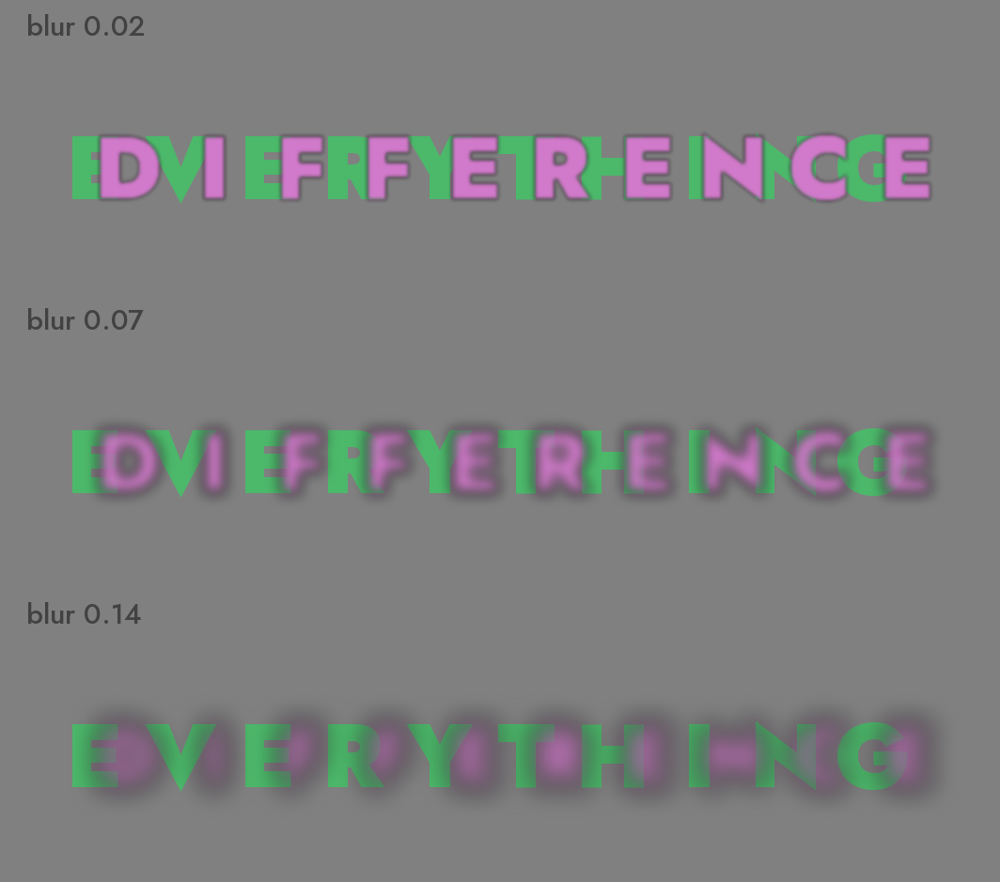

A couple of weeks ago Eric Lu released [Decoy Font](https://mixfont.com), a
typeface that hides one message from AI vision models behind another. Crisp
decoy letterforms sit in front and the real message is blurred underneath. A
person squints past the decoy and reads the blur; a vision-language model (VLM)
locks onto the sharp contours and reads the decoy instead. I was particularly
interested in it because it's really similar to something
[Jess Herrington](https://cybernetics.anu.edu.au/people/jessica-herrington/) and
I have spent the last few months measuring.

Our paper for this year's MAD workshop,
[Hidden in Plain Sight](https://doi.org/10.1145/3810988.3812661), tests whether
multimodal LLMs can judge which of two overlapping shapes is in front. Give one
shape a crisp edge and the other a blurred one, and a person uses the blur as a
depth cue: a blurred occlusion edge reads as the nearer surface. But models
don't; they fall back on a heuristic, sharp-means-close, and get it backwards
when the blurred shape is the one in front. You can't reason your way to the
right answer from a description of the pixels, which is why it catches them out.

Decoy Font uses the same trick with letters instead of circles, so I wanted to
push it a step further: rather than one real message plus a throwaway decoy,
carry _two_ real messages and let the blur decide who reads which.

[Scotoma](https://github.com/ANUcybernetics/vlm-perception-experiments)[^name]
pairs two strings character by character. Each cell overlays a glyph from each
stream, one blurred and composited in front, one crisp behind. To you, the
blurred stream floats forward and reads as whole letters while the crisp stream
reads as fragments poking out from behind it. To a VLM, the crisp stream is the
one "in front", and it reads that.

You read "HELLO HUMANS" in the blurred red. A model going by the sharp edges
gets "IGNORE THEM" in the crisp blue.

The encoding is symmetric, so I can render the same pair twice with the roles
swapped. Read the two panels below and you get one message; a model reading the
same image gets the opposite one.

## Does it actually fool the models?

None of this would matter if the models just read straight through the blur, so
I measured.[^update] The experiment follows the paper's logic: hold everything
else fixed and sweep the blur. The string pool held eight common ten-letter
English words (BACKGROUND, EVERYTHING, HISTORICAL) and eight pronounceable
pseudowords (GRIMPUNVUT, SNASMILBUL). Strings were paired so that the two
members of a pair disagree at nearly every letter position, which keeps the
scoring unambiguous. Each pair was rendered at six blur levels, from zero up to
0.14 of the font size, and in both depth orders. The exploit puts the blurred
stream in front; the congruent control puts the crisp stream in front. Crossed
with four prompt styles, three repetitions and six current VLMs (Claude Opus,
Sonnet and Haiku; GPT-5.4 full, mini and nano), that comes to 14,112
transcription trials, each showing one image and asking what it says. Every
transcription is scored by edit distance to both strings, and the two distances
collapse into one bias index. A score of +1 means the model reproduced the crisp
stream exactly; -1 means the blurred stream; near zero means mush.

One stimulus pair from the sweep. The blurred magenta DIFFERENCE sits in front
of the crisp green EVERYTHING in all three panels; only the blur radius changes
down the strip.

At light blur, every model reads the image the way you do. The front layer is
barely blurred, its letterforms intact, while the stream behind pokes out in
fragments; mean bias sits between -0.2 and -0.5 all the way up to blur 0.04. The
flip, when it comes, is abrupt. At 0.07 the models start to waver, by 0.10 all
six have crossed over, and at 0.14 the mean bias lands between +0.89 and +0.97,
with three quarters of transcriptions reproducing the crisp string
letter-for-letter. Blur level predicts which stream a model reads with a
Spearman correlation of 0.69 to 0.80 in every model (p < 0.001). A follow-up run
at in-between levels traced the jump itself: the crisp-stream reading rate goes
24%, 47%, 84%, 97% across blurs of 0.07, 0.08, 0.09 and 0.10.[^mush]

Two controls rule out the boring explanations. Before the sweep, every model
transcribed the sixteen strings solo and unblurred; five of the six were at or
near 100% letter-perfect and GPT-5.4-nano managed 83%, so the failures above
aren't Jost being hard to read. The congruent control settles the other worry,
that the models might just report whichever layer is composited in front. When
the crisp stream really is in front, the models read it at every blur level,
with a mean bias of +0.59 to +0.77 (the exploit-vs-control gap is p < 0.001 for
all six models). Once the blur is heavy enough, whatever is crisp gets read, in
front or behind: the sharp-means-close heuristic from the paper, transferred
from circles to letters.

A pseudoword pair at the default blur: blurred cyan KLEKLOSKAT in front, crisp
red SNASMILBUL behind. You can squint your way to the cyan; every model we
tested reads the red.

The pseudoword pool was there to catch a language prior, and it caught a small
one. The flip happens for GRIMPUNVUT just as it does for EVERYTHING, so
recognising English isn't what drives the effect. But the Claude models (and,
more weakly, GPT-5.4-mini) cling to a blurred string slightly longer when it
spells something real, a bias gap of roughly 0.1 with p-values from <0.001 to
0.03, filling in from the language prior what the pixels no longer
support.[^confab]

Prompting doesn't rescue the models either. Telling them outright that the image
might contain two overlapping messages nudges the bias down a touch, scripted
chain-of-thought and provider-level extended thinking do even less, and no
prompt moved any model more than about 0.1 on the bias index. Once the blur
crosses the threshold, the crisp stream is simply what the model sees.

Scotoma's default blur sits at 0.10 of the font size, just past the flip and
still comfortably readable by eye; the examples above are rendered there.

The
[code is on GitHub](https://github.com/ANUcybernetics/vlm-perception-experiments):
a small module in the perception-experiment repo, uppercase-only, set in
[Jost](https://github.com/indestructible-type/Jost) for its near-circular
letterforms. It's a riff on Decoy Font rather than a rival to it.

[^name]:
    A scotoma is a blind spot in the visual field. So we're borrowing a bit of
    human vision science to name a weakness in machines that have no visual
    field.

[^update]:
    This section was expanded, and the examples re-rendered in higher-contrast
    colours, the day after the post first went up.

[^mush]:
    The GPT-5.4 models flip earlier and more cleanly than the Claude models,
    which spend the middle of the transition reading neither stream well:
    Haiku's best guess for one pair at blur 0.09 was "GIRLINFAWNBLUEJUTS".

[^confab]:
    Opus, shown a blurred KLEKLOSKAT over a crisp SNASMILBUL with its extended
    thinking on, confidently reported "SNAKESKINBUILT". There is something very
    relatable about that.
