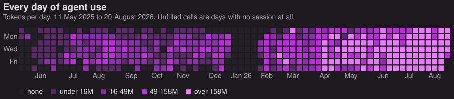
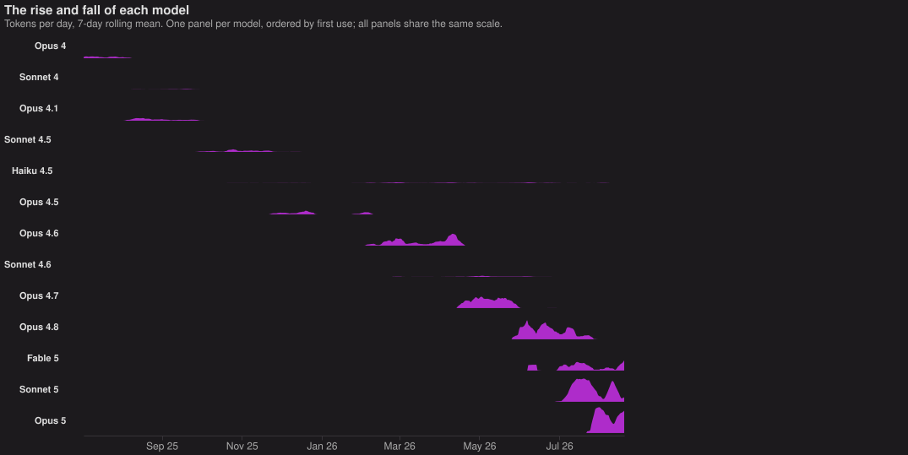
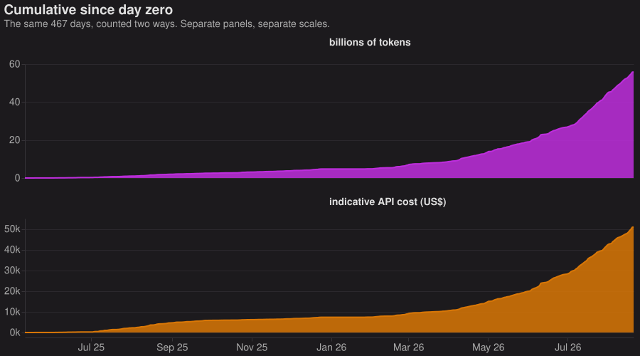
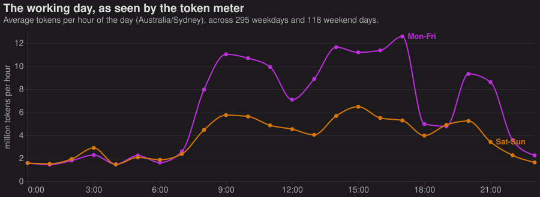
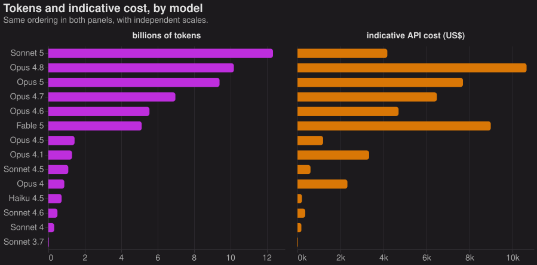
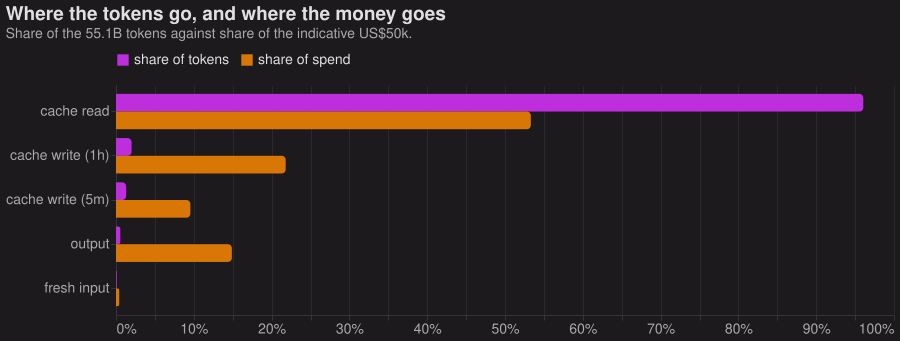

Every machine I work on ships its Claude Code session logs to my home server.
Each assistant message in there carries a `usage` block recording what it cost
to produce. Fourteen months of that comes to 24,538 transcript files and 521,862
API responses.[^dedup] Fifty-five billion tokens.

Mostly I just wanted to look at it.

The gap in January is a holiday. Everything after February is a change in how I
work.

Thirteen models in fourteen months, each taking over from the last.

Sixteen projects, three-quarters of the total.[^projects]

About 85% of the total sits in the last five months.

The 6pm cliff is dinner and bedtime. The overnight floor never quite reaches
zero, which is the scheduled agents working while I'm asleep.[^cron]

Tokens aren't fungible, since a cached input token costs a fiftieth of what an
output token does. So here is each model twice, by volume and by what it would
have cost at
[list API prices](https://platform.claude.com/docs/en/about-claude/pricing):

Sonnet 5 has the largest token count by a distance and sits sixth on cost. Opus
4.1 and Opus 4 run the other way, at 7% of the calls and 11% of the money.

Ninety-six per cent of those 55 billion tokens are cache reads: the same
conversation prefix, read back once per turn of the agent loop. Output, the part
that actually writes the code, is 0.55%.

The whole lot comes to about **US\$50,000** at list prices, over half of it
cache reads.[^caveats] Uncached, the same work would have run to roughly
\$285,000.

The charts are all [Vega-Lite](https://vega.github.io/vega-lite/), rendered to
static SVG when I wrote this. [The specs](/code/token-charts/), the data behind
them, and the scripts that walk the transcripts are all there.

[^dedup]:
    Deduplicated on the assistant message id, which matters more than it sounds:
    resuming a session from a different working directory files the same
    transcript under two project directories, and 316 files are duplicated that
    way. The count also includes 10,222 subagent transcripts, about 22% of the
    responses and 7% of the cost. I keep those out of my session counts, since
    one session fanning out to twelve agents is still one session.

[^projects]:
    The COMP4020 work still lands in three of those entries, since the studio
    repo and the course website are separate checkouts from the workspace
    directory that holds everything else. Added together they would sit second
    on the list, above llms-unplugged. Below the sixteen is a long tail of
    worktrees and one-off directories, none of it individually worth a row.

[^cron]:
    Which is also why that floor is so flat. A cron job has no opinion about
    what time it is.

[^caveats]:
    Current list prices applied retrospectively, so it's an indicative figure
    and not a bill I paid: this all ran on a Max subscription at a small
    fraction of the price. Transcripts written before Claude Code recorded the
    cache TTL split are counted at the cheaper five-minute write rate, which
    means the true number is a little above \$50k, if anything.
