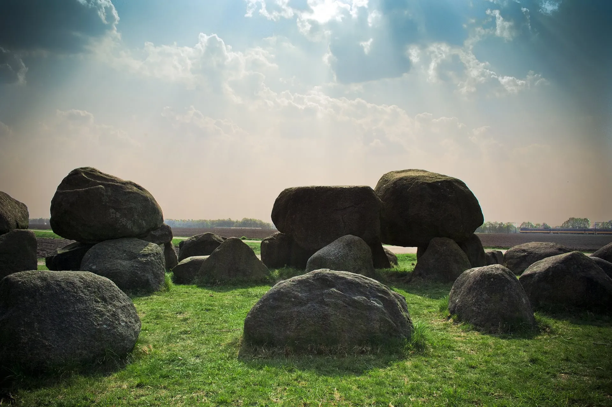

# Creative Computing

Ben Swift, School of Cybernetics

making art & music with code · All College Conference 2021

---

{/* _class: centered */}

I'd like to acknowledge and celebrate the First Australians on whose
traditional lands we meet, and pay respect to the elders past and present.

---

{/* _class: impact */}

## ANUEXT Creative Computing

[https://cs.anu.edu.au/code-creativity-culture/creative-computing/](https://cs.anu.edu.au/code-creativity-culture/creative-computing/)

---

an [ANU Extension](https://cs.anu.edu.au/code-creativity-culture/)
**H-Course** for teaching computer science to year 11 & 12 students
through making art, music and other cool things with computers

first student intake this year (applications close Feb 14), first
graduates in 2022

---

## creative computing: definition

---

## a way _in_

the creative arts aren't a way _out_ of computing, they're a way _in_

---

## today's workshop task

make a **lesson plan** for exploring a computing concept through creative
code

- pick any concept (from
  [BSSS Frameworks](https://www.bsss.act.edu.au/curriculum/Frameworks),
  [Australian Curriculum](https://www.australiancurriculum.edu.au/f-10-curriculum/technologies/digital-technologies/),
  [CS concept inventories](https://scholar.google.com/scholar?q=computer%20science%20concept%20inventory),
  [ACS CBoK](https://www.acs.org.au/content/dam/acs/acs-documents/The-ACS-Core-Body-of-Knowledge-for-ICT-Professionals-CBOK.pdf),
  or one you know students struggle with)
- not enough time for a detailed plan, but work in groups, hands on, laptops out

---

## timeline

| Time  | Activity                   |
| ----- | -------------------------- |
| 11:00 | intro & group formation    |
| 11:15 | lesson design task         |
| 12:00 | presentations & discussion |
| 12:30 | lunch 🍣🍔😋               |

---

## creative computing environments

two browser-based environments for today:

- **p5.js** --- [https://p5js.org/](https://p5js.org/) for visuals (use the
  [web editor](https://editor.p5js.org))
- **gibber** --- [https://gibber.cc](https://gibber.cc) for sound/music

you're all experienced IT educators --- you can navigate the getting
started guides, examples, etc.

example workshops from the c/c/c studio:
[p5.js](https://cs.anu.edu.au/hub/workshops/interpretation-and-code-art/),
[gibber](https://cs.anu.edu.au/code-creativity-culture/workshops/laptop-music/)

---

## what's the deliverable?

a 2min presentation/demo of your lesson to the rest of this workshop

for scoping, ask yourself:

> what are the _minimal_ notes I'd give to a teacher (that I _like_)
> 30min before having to deliver this lesson to a College IT class?

---

## group formation

groups of 2--3

try to find others with similar interests along the music/visuals axis

---

## discussion questions

1. which computing concept did you choose, why, and how (if at all) did
   the "creative" aspect influence that decision?
2. what type of task did you set your students? (convergent, divergent)
3. how would you assess it --- what might the rubric look like?
4. what scaffolding is required to do this in a College IT context?
5. was it _fun_?

(remember, presentations start at 12:00pm)

---

{/* _class: impact */}

**presentation time**

---

## wrap up

thanks so much for participating

I'm keen to:

- make contacts
- get the word out about
  [ANU Extension Creative Computing](https://cs.anu.edu.au/code-creativity-culture/creative-computing/)
- be part of a CoP around creative computing for students and educators

---

## stay in touch

[ben.swift@anu.edu.au](mailto:ben.swift@anu.edu.au)

[https://benswift.me](https://benswift.me)

[https://cs.anu.edu.au/code-creativity-culture/creative-computing/](https://cs.anu.edu.au/code-creativity-culture/creative-computing/)

---

{/* _class: impact */}

👋
