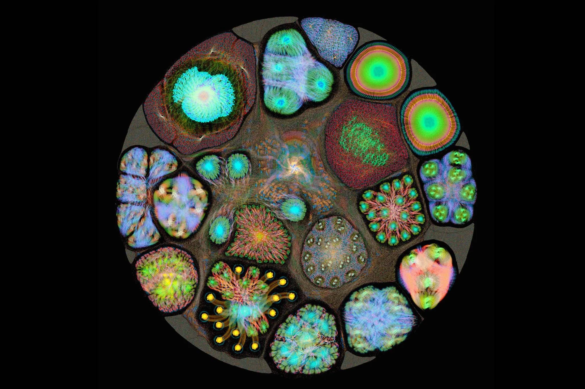
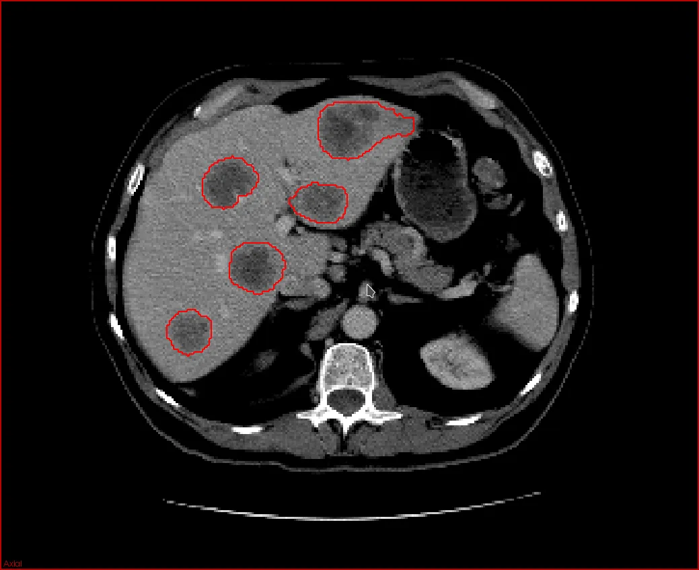

# The role of myth in AI

Ben Swift, School of Cybernetics

ARTH2165: Theories of the Image

---

{/* _class: impact */}

first, tell me about **yourselves**

---

## style transfer

- [https://github.com/NVIDIA/FastPhotoStyle](https://github.com/NVIDIA/FastPhotoStyle)
- [https://github.com/lengstrom/fast-style-transfer](https://github.com/lengstrom/fast-style-transfer)
- [https://genekogan.com/works/style-transfer/](https://genekogan.com/works/style-transfer/)

---

<iframe
  width="100%"
  height="100%"
  src="https://www.youtube.com/embed/U4Q98lenGLQ"
  frameborder="0"
  allowfullscreen
></iframe>

---

<iframe
  width="100%"
  height="100%"
  src="https://www.youtube.com/embed/36lE9tV9vm0"
  frameborder="0"
  allowfullscreen
></iframe>

---

{/* _class: impact */}

AI == **deep learning**

_(possibly)_

---

{/* _class: impact */}

what is this **deep magic**?

---

## but _how_?

what are the folk theories about how this works?

what have you heard on the grapevine?

---

## the popular image

---

## the actual image

[@quasimondo](https://twitter.com/quasimondo)

---

## how do we talk about this stuff?

[An AI Learned To Make Fireworks, And They're Mesmerizing](https://www.fastcodesign.com/90156087/an-ai-learned-to-make-fireworks-and-theyre-mesmerizing)

[This AI Paints Like The Old Masters. Can You Tell The Difference?](https://www.fastcodesign.com/90167584/this-ai-paints-like-the-old-masters-can-you-tell-the-difference)

---

{/* _class: impact */}

where's the **authorship**?

where's the **agency**?

are you more or less worried than before?

how does this even work?

---

{/* _class: impact */}

🤔
