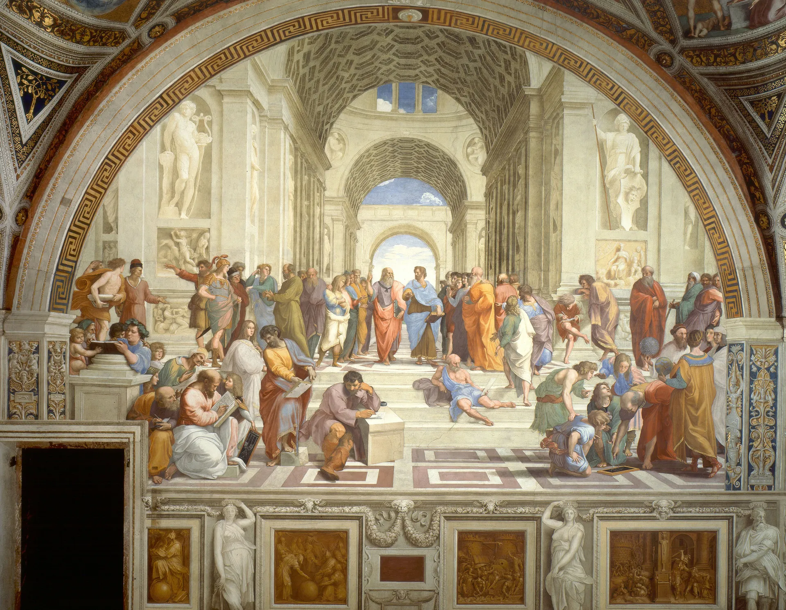
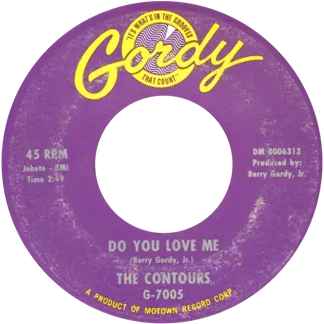
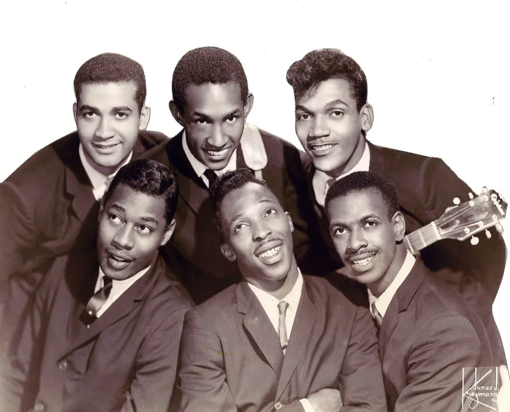
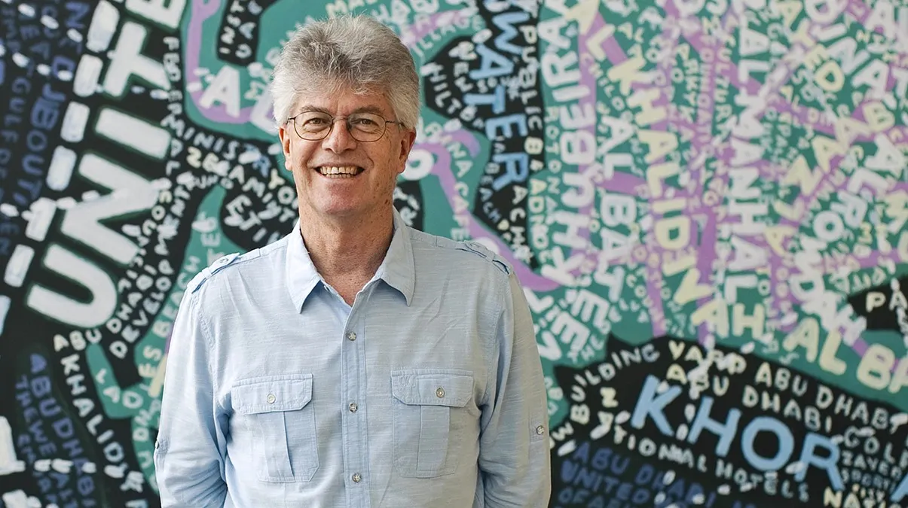

import EuclideanRhythm from "../components/svelte/EuclideanRhythm.svelte";

# From Classics to Colonialism

Ben Swift, School of Cybernetics

via drum circles

---

{/* _class: centered */}

I'd like to acknowledge and celebrate the First Australians on whose
traditional lands we meet, and pay respect to the elders past and present.

---

## outline

- part un --- Euclid's algorithm
- part deux --- sounding bodies and Euclidean Rhythms
- part trois --- what does it all mean?

---

{/* _class: impact */}

391 578

what's the _biggest_ number which divides evenly into both of these
numbers?

---



## the Euclidean algorithm

the Euclidean algorithm for computing the greatest common divisor of two
integers is one of the oldest known algorithms (circa 300 B.C.)

first described in Euclid's _Elements, Proposition 2, Book VII_

independently discovered in several other places (China, India)

---

{/* _class: quote */}


> granddaddy of all algorithms, because it is the oldest nontrivial
> algorithm that has survived to the present day
>
> **Donald Knuth**, _TAOCP Vol. 2_

---

## in plain English

To find the **g**reatest **c**ommon **d**ivisor of two numbers (_a_ and
_b_), repeatedly replace the larger of the two numbers by their
difference until both are equal. This final number is then the greatest
common divisor.

([source](https://www.sciencedirect.com/science/article/pii/S0925772108001156))

---


---

## why?

early on: tiling, astronomy, calendars

these days: _many applications_ (e.g. number theory, cryptography)

---

## in code

```xtlang
(define (gcd a b)
  (if (= a b)
      a
      (gcd (min a b) (abs (- a b)))))
```

---

## in code (a bit more efficient)

```xtlang
(define (gcd a b)
  (if (= a 0)
      b
      (gcd (modulo b a) a)))
```

---

## rhythmic notation

three patterns to compare:

<EuclideanRhythm pattern="1:0,0:1,0:2,0:3,1:4,0:5,0:6,0:7;1:0,0:1,1:2,0:3,1:4,0:5,1:6,0:7;0:0,1:1,1:2,0:3,1:4,1:5,1:6,0:7" />

---

## four patterns of different lengths

<EuclideanRhythm pattern="1:0,0:1,0:2,1:3,0:4;1:0,0:1,0:2,1:3,0:4,1:5,0:6;1:0,0:1,1:2,0:3,0:4,1:5,0:6,1:7,0:8,1:9,0:10,0:11" />

---

## euclid(3, 8)

same basic idea as Euclid, although attributed to Bjorklund

<EuclideanRhythm pattern="1:0,1:1,1:2,0:3,0:4,0:5,0:6,0:7" />

---

## euclid(3, 8) --- step 2

<EuclideanRhythm pattern="1:0,1:1,1:2,0:3,0:4;0:5,0:6,0:7" />

---

## euclid(3, 8) --- step 3

<EuclideanRhythm pattern="1:0,1:1,1:2;0:5,0:6,0:7;0:3,0:4" />

---

## euclid(3, 8) --- final

<EuclideanRhythm pattern="1:0,0:5,0:3,1:1,0:6,0:4,1:2,0:7" />

**aka:** cuban _tresillo_

---

## euclid(5, 12)

<EuclideanRhythm pattern="1:0,1:1,1:2,1:3,1:4,0:5,0:6,0:7,0:8,0:9,0:10,0:11" />

---

## euclid(5, 12) --- step 2

<EuclideanRhythm pattern="1:0,1:1,1:2,1:3,1:4,0:5,0:6;0:7,0:8,0:9,0:10,0:11" />

---

## euclid(5, 12) --- step 3

<EuclideanRhythm pattern="1:0,1:1,1:2,1:3,1:4;0:7,0:8,0:9,0:10,0:11;0:5,0:6" />

---

## euclid(5, 12) --- step 4

<EuclideanRhythm pattern="1:0,1:1,1:2;0:7,0:8,0:9;0:5,0:6;1:3,1:4;0:10,0:11" />

---

## euclid(5, 12) --- final

<EuclideanRhythm pattern="1:0,0:7,0:5,1:3,0:10,1:1,0:8,0:6,1:4,0:11,1:2,0:9" />

**aka:** South African _Venda_, Macedonia, Central African Republic,
Tool's _Schism_, and many more

---

## euclid(5, 8)

<EuclideanRhythm pattern="1:0,0:1,1:2,1:3,0:4,1:5,1:6,0:7" />

**aka:** cuban _cinquillo_

---

{/* _class: quote */}


> Line up the boxes in one row (_ones_ on the left), then move the
> rightmost _zeroes_ "under" the left-hand _ones_.
>
> If there's more than one short ("hanging chad") column on the right,
> take as many of those short columns as you can and move them to below
> the tallest (left-hand) columns --- and repeat this process until
> there's no more than one short column.

---

## paper "results"

- a simple algorithm for generating Euclidean rhythms
- a laundry list of examples of these rhythms "in the wild"
- proofs of a number of "nice" mathematical properties of Euclidean
  rhythms
- some kite-flying about the relationship between said nice properties
  and the human cultural practices associated with musicmaking

---


## musicologists

not all widely-used rhythms in the world are Euclidean

---


## algorithmic composers

here's a low-dimensional (2--3 parameter) interface for generating a wide
range of interesting-sounding and culturally-significant rhythms to get
people **dancing**

---

{/* _class: impact */}

musician → simple interface → cultural domain

---


---


---

{/* _class: quote */}

> ...such rhythmic structures [Euclidean rhythms] can be fruitfully
> regarded not only as retentions of African musical and cultural
> heritage, but also as a way of theorizing the threads of continuity
> that exist between many of the disparate musics and cultures that
> have shared African roots, but have been radically altered by the
> passage of time and cross-cultural contact and musical hybridity.
>
> _Stewart, J (2010)._
> [Articulating the African Diaspora through Rhythm](https://www.jessestewart.ca/media/african_diasporic_rhythm.pdf)

---

{/* _class: quote */}

> The rules of American commercialism permit us to circumvent indigenous
> labor, employing indigenous know-how to re-construct crude facsimiles
> of sacred objects and sophisticated musical instruments. The
> commercialisation of the pseudo-African Drum is socially, ethically
> and legally upheld by our moral framework. It is, however, in
> violation of the ethic of the ethnic Drum.
>
> _Friedberg, L (2003)._
> [Drumming for Dollars](https://www.chidjembe.com/drumdollars.html)

---

<iframe
  width="100%"
  height="100%"
  src="https://www.youtube.com/embed/fn3KWM1kuAw"
  frameborder="0"
  allowfullscreen
></iframe>

---



---



---


---



---


---


## Ben said the Euclidean algorithm is racist!

well, maybe... but that's not the main point here

you learned it earlier --- I saw you --- so you're implicated

algorithms (even simple ones!) can give us leverage in cultural domains.
can/how do we use them safely, sustainably, at _scale_?

---

{/* _class: quote */}

> Machine learning is like money laundering for bias.
>
> **Maciej Cegłowski**, [_The Moral Economy of Tech_](https://idlewords.com/talks/sase_panel.htm)

---

## what did you learn?

Euclid's algorithm!

> To find the **g**reatest **c**ommon **d**ivisor of two numbers (_a_
> and _b_), repeatedly replace the larger of the two numbers by their
> difference until both are equal. This final number is then the
> greatest common divisor.

yes, **it will be on the final exam**

---

{/* _class: impact */}

questions?

---

{/* _class: impact */}

[https://apps.musedlab.org/groovepizza/](https://apps.musedlab.org/groovepizza/)
