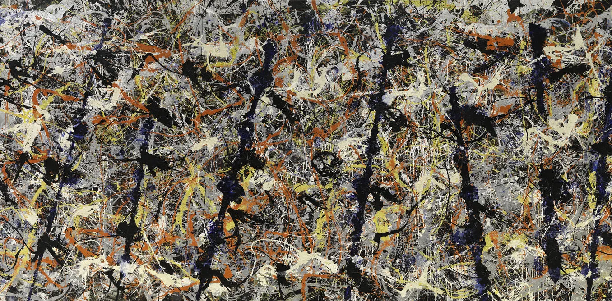
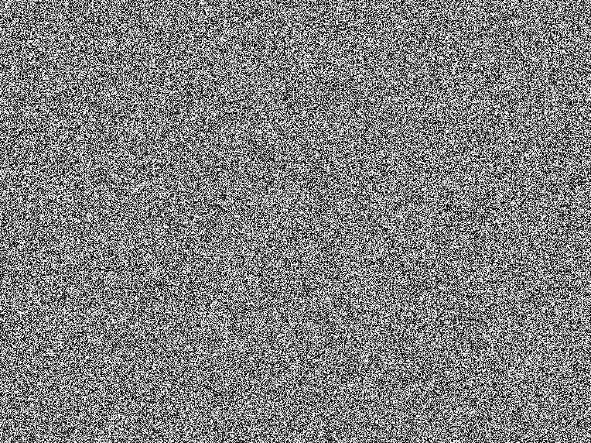
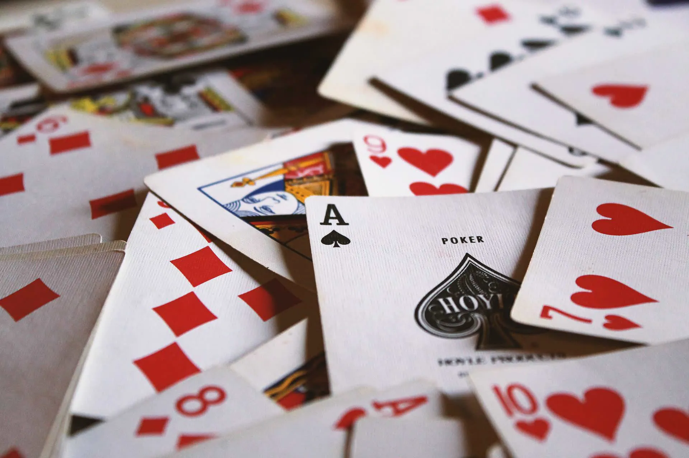
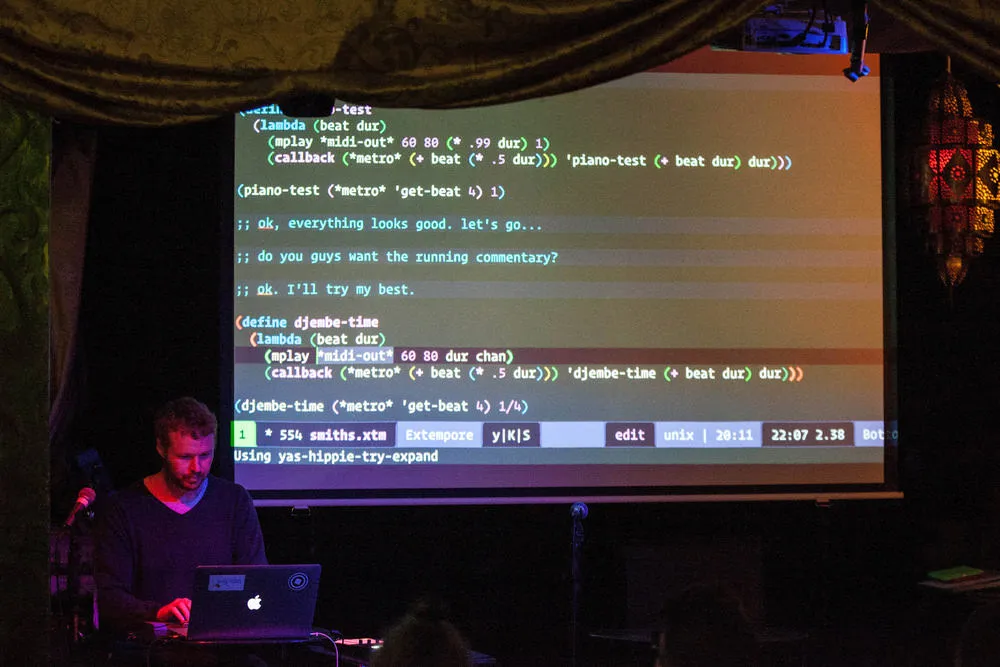

# The creative potential of random

Ben Swift, School of Cybernetics

COMP1720 Guest Lecture 2017

---



---



---

## synopsis

- randomness: highlights from history
- different **types** of randomness
- mapping: using randomness effectively

---


## story

---



---

{/* _class: impact */}

if you're reading the slides at home, **watch the video**

---



## livecoding

---

## randomness in music has a long history

musikalisches würfelspiel (18th century)

aleatoric music (20th century)

some of our labs have explored randomness in various forms

---

## types of randomness

not all randomness is created equal

but this **isn't** a maths lecture

---

## three useful types for artists

1. uniform --- [`random([min], [max])`](https://p5js.org/reference/#/p5/random)
2. gaussian --- [`randomGaussian()`](https://p5js.org/reference/#/p5/randomGaussian)
3. discrete --- [`random(choices)`](https://p5js.org/reference/#/p5/random) (Array version)

---

## uniform random numbers

start with two numbers (`min` and `max`)

picks any number between those two numbers

all numbers in the range are **equally likely**

this last point is the key attribute of random numbers

---

## gaussian random numbers

picks a number _around_ some middle point

numbers closer to that middle point are **more likely** than ones further
away

named after Carl Friedrich Gauss

also known as: _normal distribution_, _bell curve_, etc.

---

## discrete random variables

sometimes there are a fixed number of outcomes, either equally likely or
some more likely than others

e.g. coin toss, roll of the dice, football match

let's look at the reference for
[`random()`](https://p5js.org/reference/#/p5/random) again --- if passed
one parameter which is an array, the return value will be one of the
elements of the array, selected at random (all equally likely)

---

## different likelihoods, technique 1

if you want some outcomes to happen more often than others, add multiple
identical elements to the array (think about why this works?)

```js
var loadedDice = [1, 2, 2, 2, 2, 3, 4, 5, 6];
var roll = random(loadedDice);
```

---

## different likelihoods, technique 2

if you want one thing to happen e.g. 10% of the time, and something else
the other 90%

1. use `random(100)` to get a random number between 0 and 100
2. if the result is _less than_ 10, do the first thing; otherwise do the
   other

---

## mapping: using randomness effectively

mapping (I know the word "map" is overloaded in programming) here means
what do you _do_ with the randomness

in my livecoding I use random numbers to control or modulate: **pitch**,
**loudness**, **duration**, **rhythm**, **timbre**, and more

---

## mapping random numbers in your sketches

think about how (and what kinds) of randomness you could use to control:
**position**, **size/shape**, **colour/transparency**, **stroke/fill**,
etc.

what's the right balance between **predictability** and **surprise**?

choosing where to use randomness, where not to use it, and what type:
_this is where the art happens_

---

## re-creating the random pixels image

```js
loadPixels();
for (var i = 0; i < pixels.length; i++) {
  if (random() < 0.5) pixels[i] = 0;
  else pixels[i] = 255;
}
updatePixels();
```

---


## re-creating Blue Poles?

---

{/* _class: impact */}

🤔
