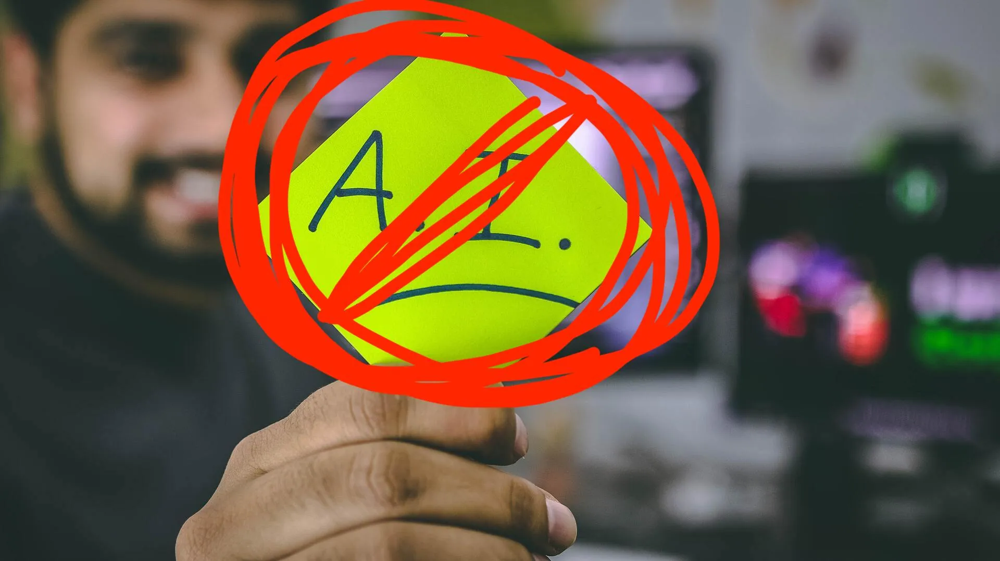
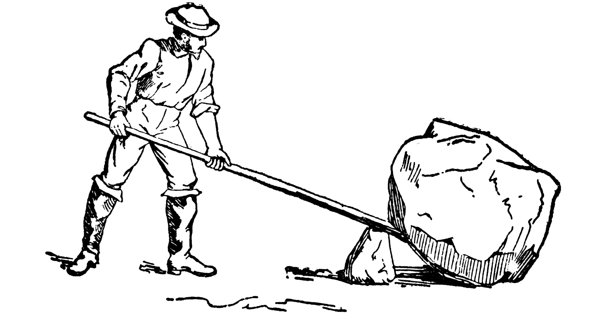
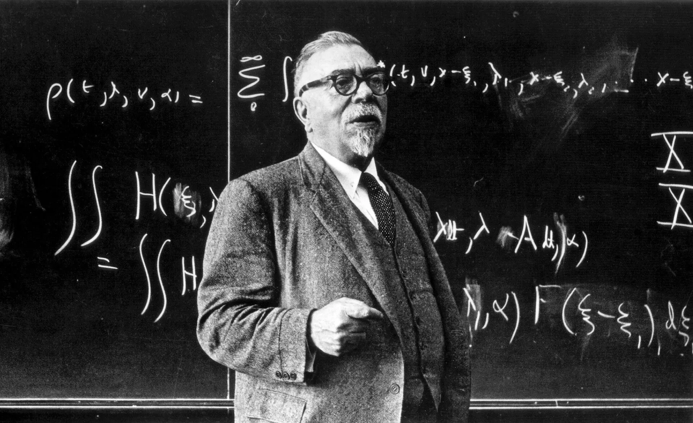
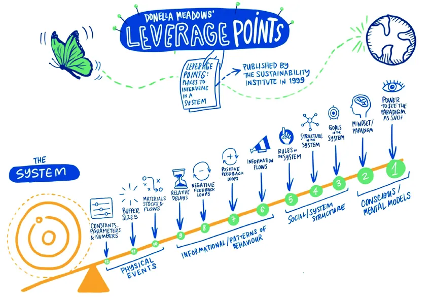

# Livecoding for leverage

Ben Swift, School of Cybernetics

Design Guild NSW · November 2021

---

{/* _class: centered */}

I'd like to acknowledge and celebrate the First Australians on whose
traditional lands we meet, and pay respect to the elders past and present.

---

{/* _class: centered */}

## who am I?

---

## outline

| Time  | Topic                         |
| ----- | ----------------------------- |
| 11:05 | intro: livecoding (yay)       |
| 11:20 | but _why_?                    |
| 11:25 | leverage in a cultural domain |

---

## intro

---

{/* _class: impact */}

but **why**?

---

---

---

---

## leverage in a cultural domain

---

{/* _class: impact */}

a **lever** is a (designed) interface

---

## language = leverage (process design)

---

{/* _class: quote */}

> The shift from 'architect' to 'gardener' --- from someone who carries a
> full picture of the work before it is made, to someone who plants seeds
> and waits to see what will come up.
>
> [**Brian Eno**, _Composers as Gardeners_](https://www.edge.org/conversation/brian_eno-composers-as-gardeners)

---

{/* _class: quote */}

> Programmers are trained to seek maximal and global solutions. Why solve a
> specific problem in one place when you can fix the general problem for
> everybody, and for all time?
>
> [**Maciej Cegłowski**, _The Moral Economy of Tech_](https://idlewords.com/talks/sase_panel.htm)

---

---

{/* _class: quote */}

> control & communication in the (livecoding) animal and the machine
>
> _Wiener_

---

---

## ANU School of Cybernetics

come partner with us to help us figure it out

---

{/* _class: impact */}

**fin**
