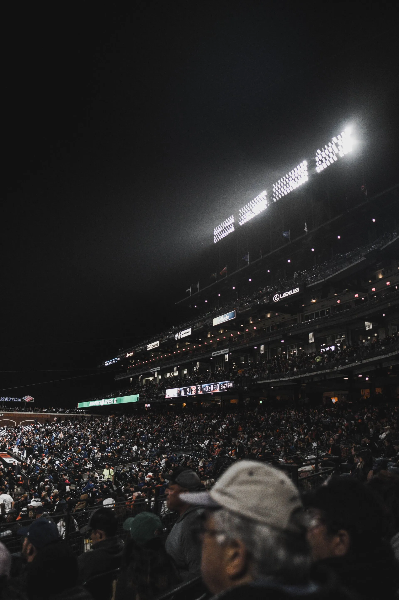
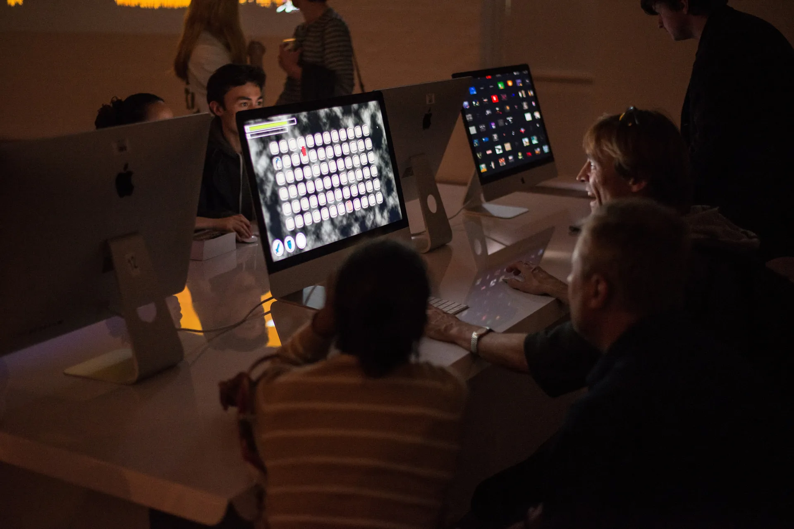
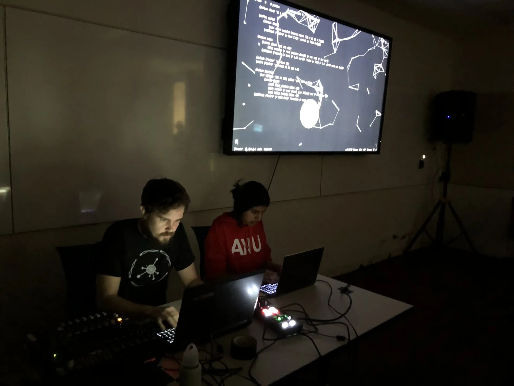
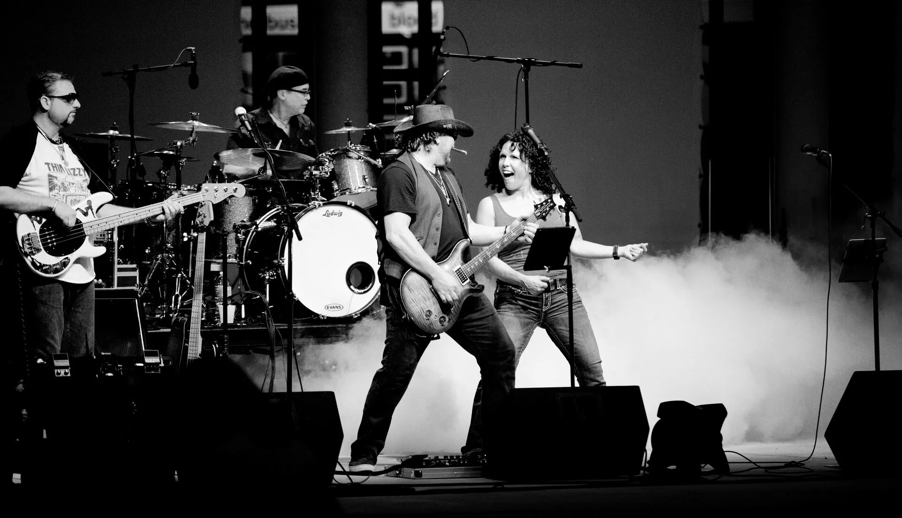
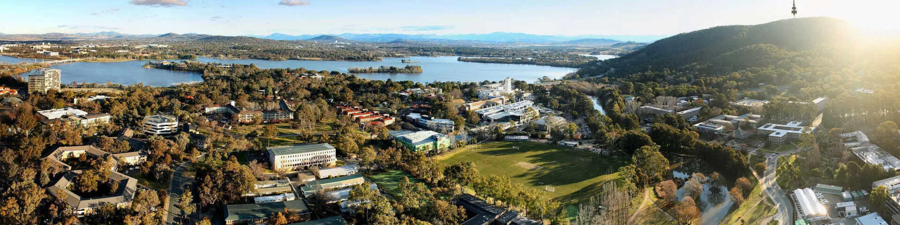
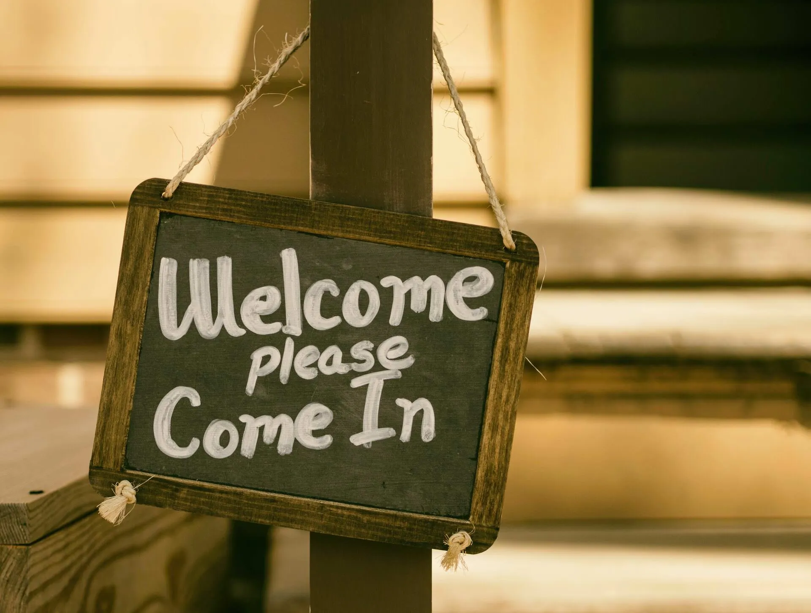
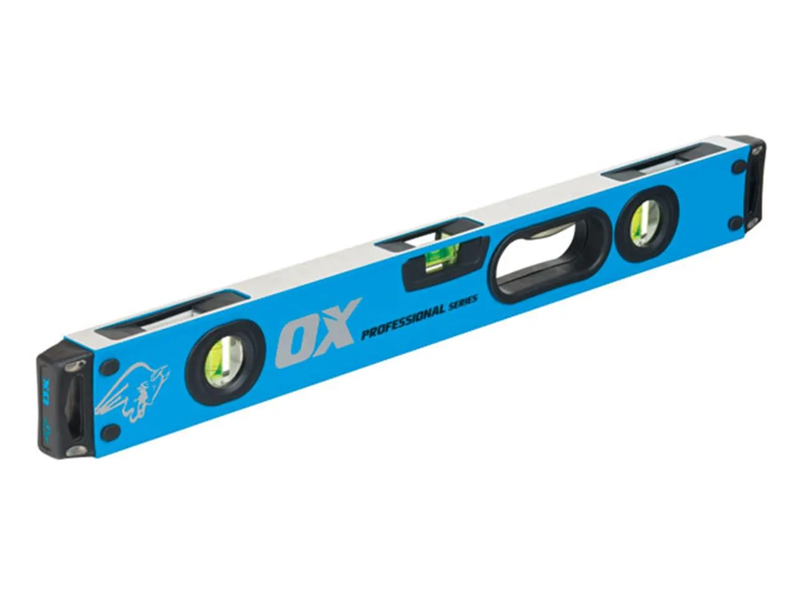
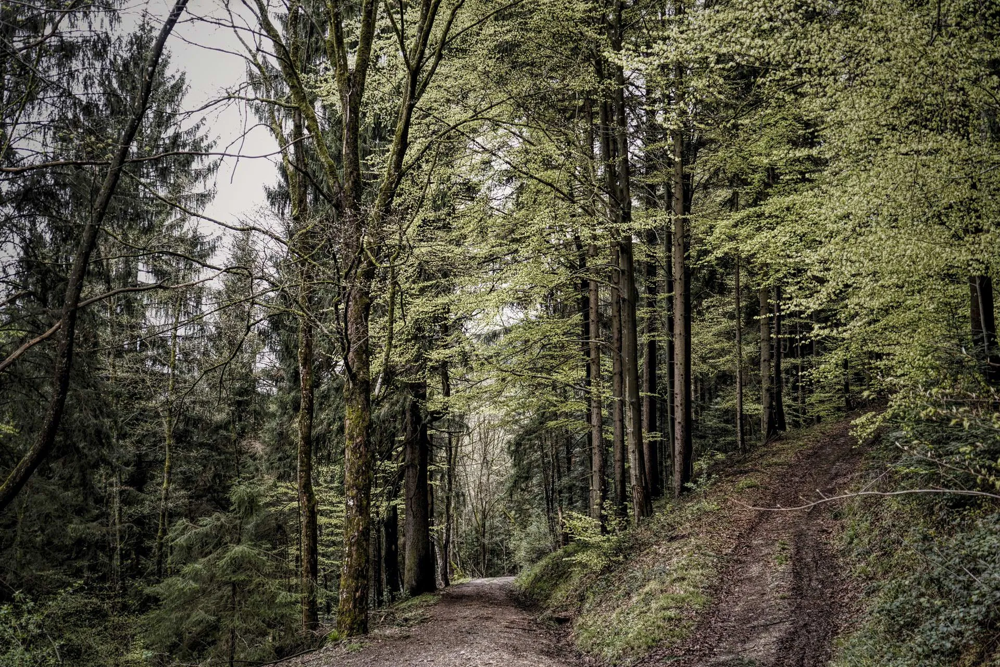

# Designing the c/c/c studio

Ben Swift, School of Cybernetics

10 years of teaching artists to code and coders to art

---

## outline

- 10 years of art & code at ANU
- the c/c/c studio and the Reimagine project
- discussion questions

---

{/* _class: impact */}

but first, some **music**

---

## so many qualifications

10¹ years of teaching artists² to code³ and coders⁴ to art⁵

1. _10 years_ --- well, 9 actually (since 2011)
2. _artists_ --- mix of CS majors, art majors, and others
3. _code_ --- yeah, I know, CSEd is more than just coding
4. _coders_ --- see "artists"
5. _art_ --- to create something of aesthetic/poetic/ethical value

---

## my story

💻 + 🎵 = 🤯

---

## CS @ ANU

loads of students, large classes

some resources are plentiful, others scarce

huge opportunities, but how to make the most of them?

---

## COMP1720

Art & Interaction in New Media

first-year elective for both CS & art students

started in 2011 (~50 students); 2019 enrolment ~250 (80% CS, 20% art)

major project (40% of grade) is an interactive browser-based artwork in
p5.js

[https://cs.anu.edu.au/courses/comp1720/](https://cs.anu.edu.au/courses/comp1720/)

---

## what's good, what's hard

**good:** lots of students new to programming (some stick around);
forces students to figure out what excellent work looks like

**hard:** wide range of "starting places"; some CS students struggle
with the subjectivity

---

## COMP2710: Laptop Ensemble

later-year elective for both CS & music students

started in 2018; "boutique" class (under 20 students)

[https://comp.anu.edu.au/courses/laptop-ensemble/](https://comp.anu.edu.au/courses/laptop-ensemble/)

---

## this year in LENS

flipped mode

whole-class crits & jams

---

## what's good, what's hard

**good:** similar to COMP1720; get to assess my students in a nightclub

**hard:** getting students to truly work as an _ensemble_; getting
students to grow during the course

---

## Reimagine

a **$350m+ investment** in CS & Eng at ANU

new departments, 2x faculty

finding new ways of being a computer scientist

a series of Reimagine Fellowships to support this

---

## The c/c/c studio

I've been awarded a fellowship to build the **c/c/c studio**

an A-levels extension course in creative computing (selective entry, 2
year program)

small cohorts (under 20/year), first intake in 2021, first graduates in 2022

a joint venture between CS & the art/music schools

---

## c/c/c studio curriculum

2h on-campus, ~4h self-study per week

**1st year:** interactive visual & generative art ([p5.js](https://p5js.org))

**2nd year:** computer music & livecoding ([Extempore](https://extemporelang.github.io)
& [Pd](https://puredata.info))

studio-based learning --- students conceive, plan and build something
each year, with an exhibition at the end

needs board of education approval

---

{/* _class: impact */}

but **why**?

---

---

---

---

## central thesis

making music & art isn't a side track on the road to computing

---

## discussion questions

- can we go all in on creative coding? could this be CS101?
- how do we make the cultural artefact part of the incentive scheme?
- what's the appropriate entrance exam/portfolio/other?
- how do we make sure we don't just stretch the privileged kids?
- how do we study it?
- how do we scale it?
- what do we call it?

---

## what's next?

if you'd like to chat, let me know 😊 --- I'm here till Thursday

---

{/* _class: impact */}

questions?
