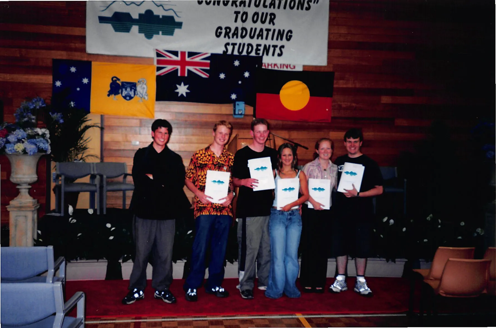
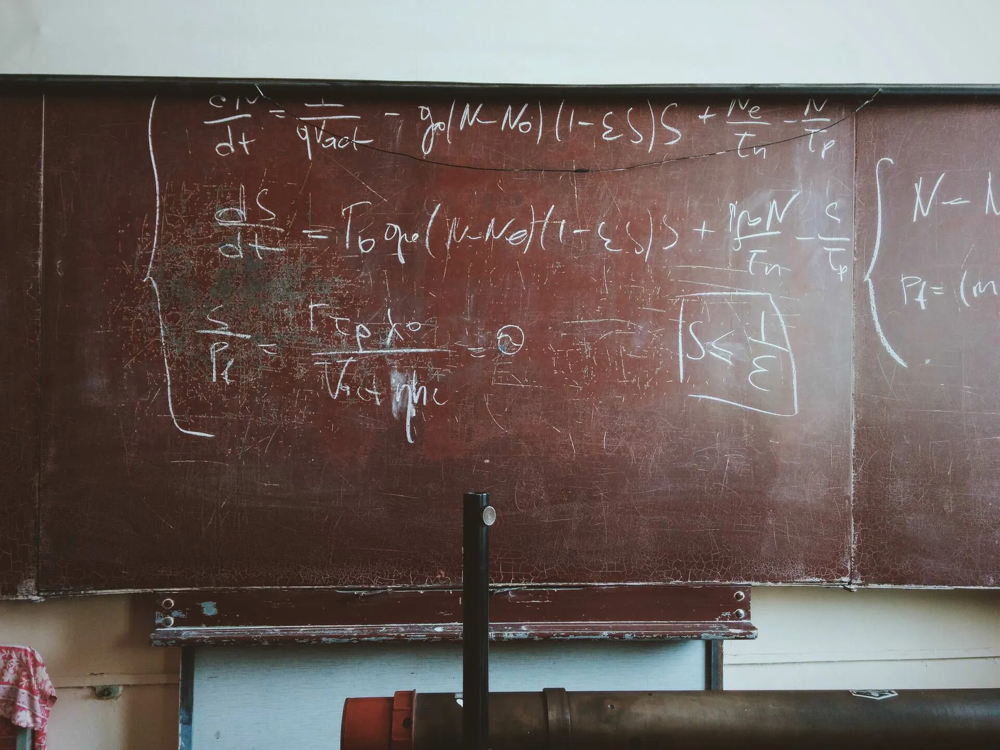
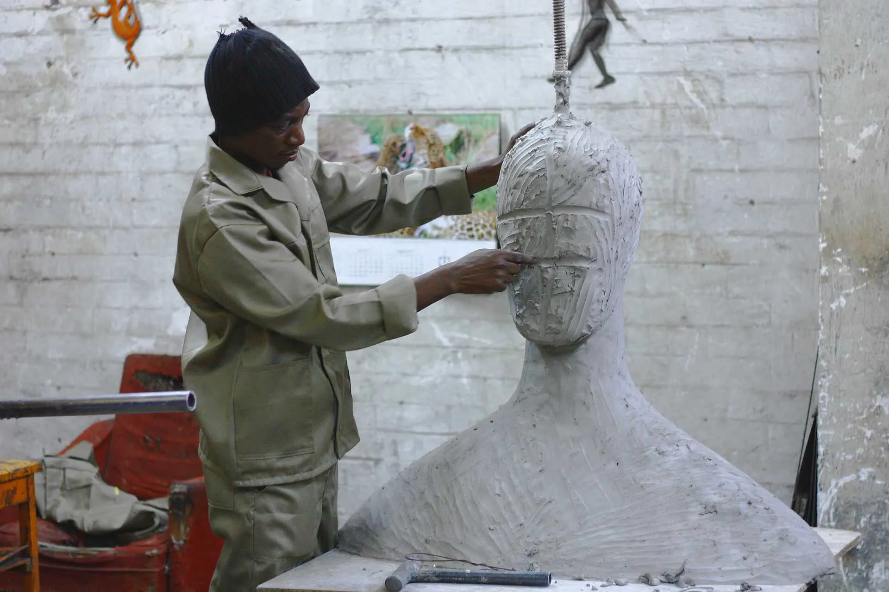
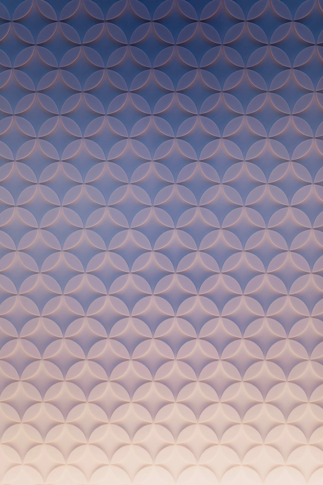
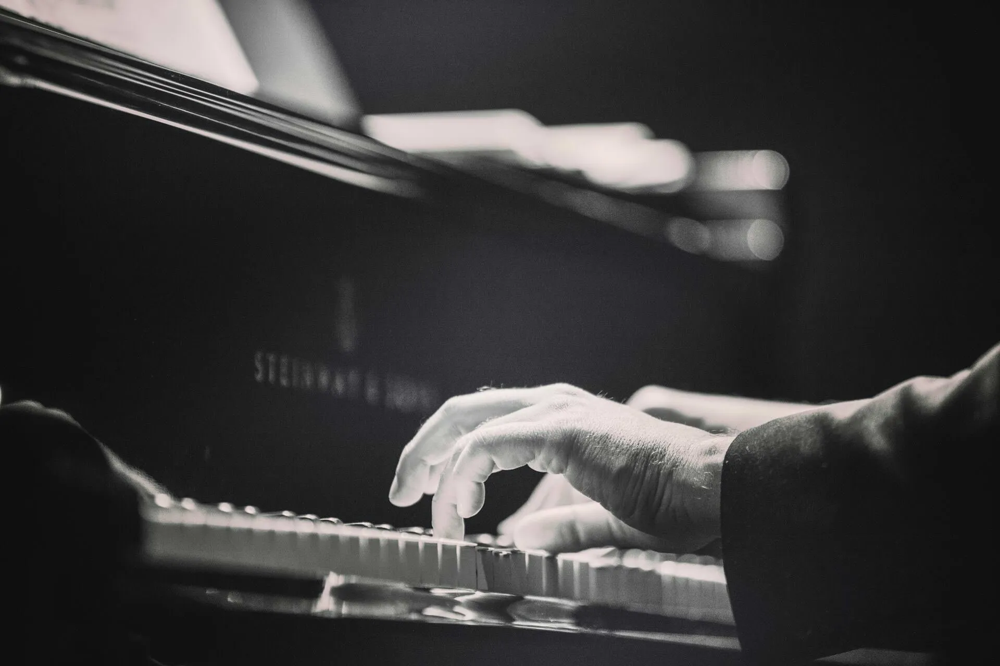
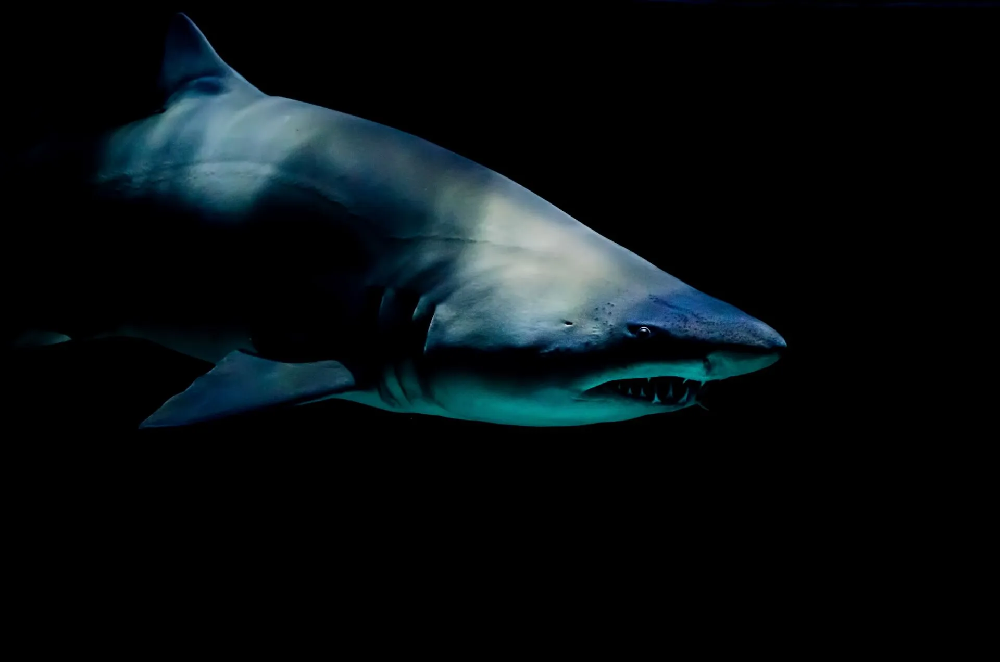
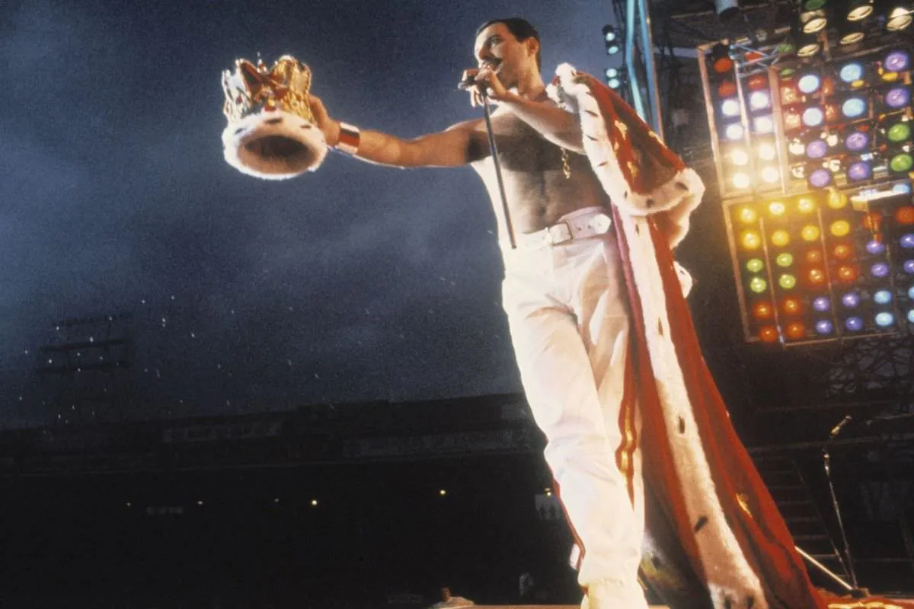
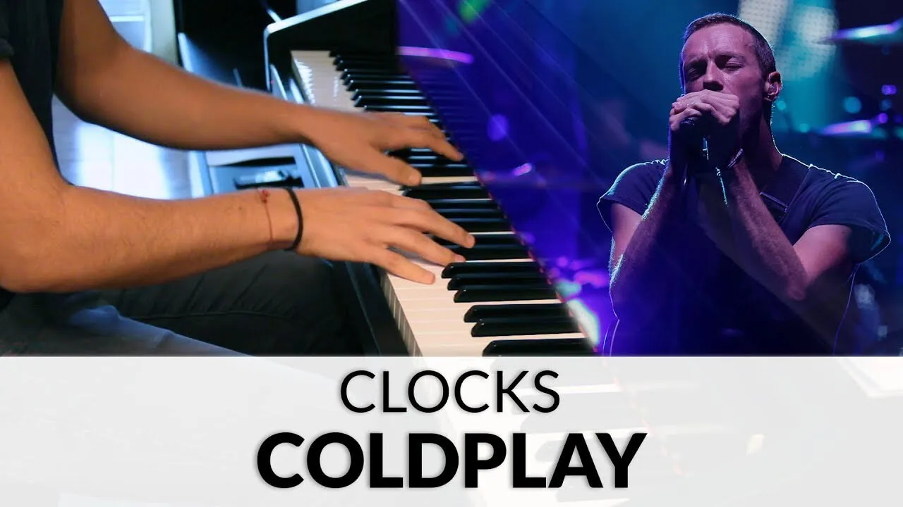
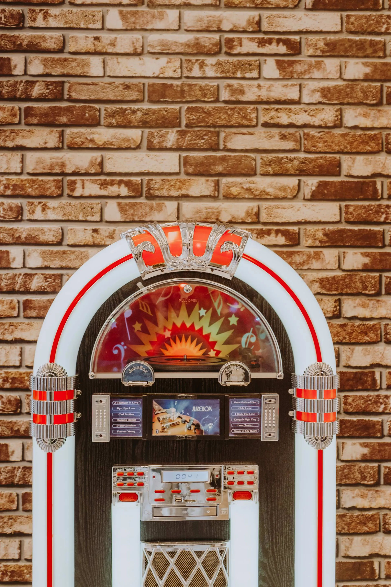

# Musical instructions

Ben Swift, School of Cybernetics

Lake Tuggeranong College STEM Camp

---

{/* _class: impact */}

can y'all keep a secret?

---



---


---

{/* _class: impact */}

enough about me...

tell me about **you**

---


## musicians?

---



## mathematicians?

---


## coders?

---


---

{/* _class: impact talk */}

## talk

music, maths, computers --- what's the connection?

what are computer programs good at?

what would a song performed by a computer program sound like?

---

## outline

- what is (pop) music?
- activity: _low-tech_ musical instructions
- livecoding: _high-tech_ musical instructions

---

{/* _class: impact */}

**music** _(n.)_

a series of pitched "events" over time

---


## pedantry alert

catchy hooks

repetitive harmonic patterns (e.g. chord progressions)

processed/synthetic sounds (lots of computers involved)

---

{/* _class: impact */}

lots of **patterns**

but how do we express them?

---

## "dimensions" of a musical note

1. time
2. pitch
3. loudness

---


## time

what aspects of the music does it influence?

why is it important?

how do we measure it?

---


## loudness

what aspects of the music does it influence?

why is it important?

how do we measure it?

---



## modelling the domain

remember: music is a series of musical events

each event has a time, a pitch and a loudness

---

## maths recap 1: functions

function _f(x, y)_ takes two parameters and returns a result

e.g. _f(x, y)_ = _8x_ + _2y_

parameters are _input_; the function produces an _output_

---

## maths recap 2: modular arithmetic

arithmetic which "wraps around"

0, 1, 2, 0, 1, 2, 0, 1, 2, ... instead of 0, 1, 2, 3, 4, 5, 6, ...

the modulus can be any integer, e.g.

- 7 _mod_ 4 is 3
- 18 _mod_ 7 is 4

---


## example: clock

---



## patterns

---


## are

---


## everywhere

---

{/* _class: impact */}

**activity**: musical instructions

---

## how to play

split into pairs

I'll tell one person (person A) the name of a song

person A will write down (in _English_) instructions for how to play the
song (**no conventional music notation allowed**)

person B will read the instructions, "sing" them, and try to guess what
the song is

---



## scales (just a warm-up)

---



## Jaws

---



## We Will Rock You

_remember_: describe the instruments, **not** the vocal track

---



---


## This is America

---



## your choice of song

---

{/* _class: impact talk */}

## talk

what was the hardest part?

what was the easiest?

was it easier/harder than you expected?

how would you do it differently next time?

---

## what _I'm_ gonna do

learn a new song (by ear!)

figure out how to turn it into code

find sounds which sound (approximately) like the recording

lay down a vocal track (maybe)

make the whole process make sense to you

---

## what _you're_ gonna do

help me choose the song

be kind when I make mistakes

clap politely at the end (even if I flame out)

---


## reminder: domain model

**time** (in beats): 0, 1, 2, 3, 4, 5, 6, 7, 8

**pitch** (in MIDI note numbers): middle C as 60, C# as 61, etc.

**loudness** (0 is silent, 127 is super loud)

---

## extempore: a livecoding _language_

[extempore](https://extemporelang.github.io/) is a programming language
designed for musical livecoding (written by [Andrew Sorensen](https://twitter.com/digego)
and [me](https://benswift.me))

`mplay` is the key function:

```xtlang
;;                pitch loud duration   instrument
(mplay *midi-out* 60    80   (* .5 dur) 1)
```

don't worry about the syntax --- I'll explain enough for you to follow

---


## I'm old...

---

## what did we learn?

pop music isn't black magic --- it's a domain with lots of structure and
patterns

we can write instructions which express those patterns

computers and code are _really useful_ for modelling/exploring this stuff

this is _not_ AI, either

---

## c/c/c studio

in 2020 I'm starting an art+music+code extension program at the ANU

we'll do stuff like this (and lots more)

if you're interested, let me know 😊

---

{/* _class: impact */}

🤔

[ben.swift@anu.edu.au](mailto:ben.swift@anu.edu.au)

[https://benswift.me](https://benswift.me)
