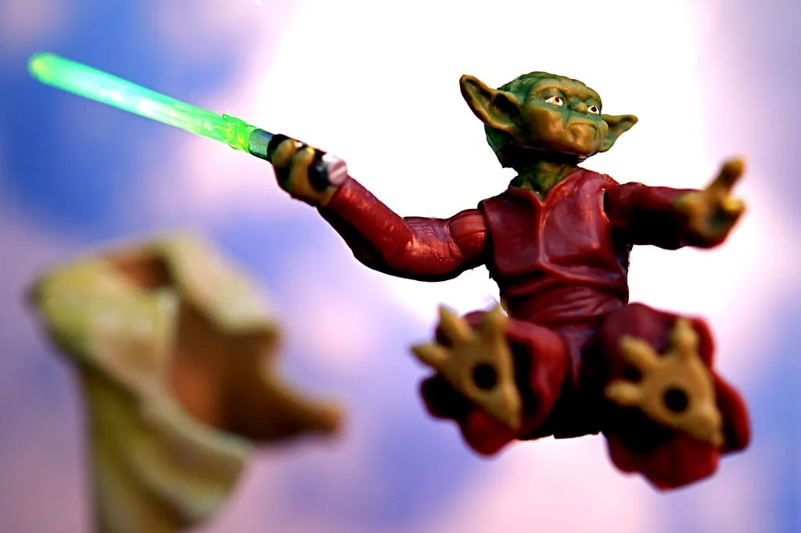
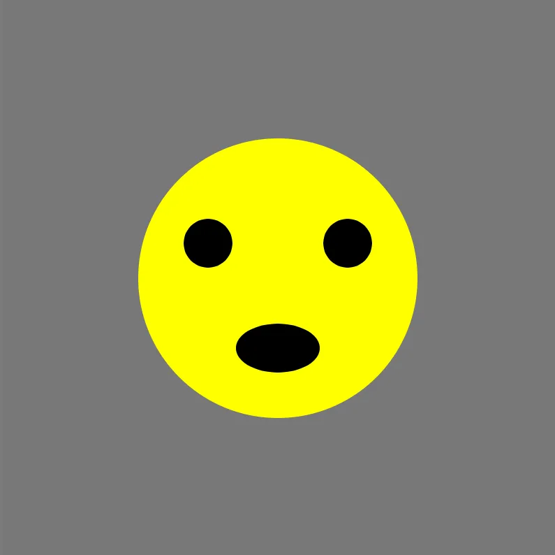

# Drawing like a 5-year-old

Ben Swift, School of Cybernetics

Telopeal High School STEM Day

---


## who drew pictures as a 5yo?

---

## your "hour of code"

[https://hourofcode.com/](https://hourofcode.com/)

teach the computer to draw a picture

learn how to deal with its tantrums

share your stuff with the world

---

## p5.js

open up a web browser (e.g. Firefox) and head to [https://editor.p5js.org/](https://editor.p5js.org/)

**(optional)** if you want to share your work later, create an account
(super-easy, and free)

---

## edit the code

```js
function setup() {
  createCanvas(800, 800);
}

function draw() {
  // add this next line on your computer
  background(220);
  rect(0, 0, 100, 100);
}
```

don't forget to hit the play button!

---


## collaboration

---

## can you draw the square **differently**?

- bottom right
- tall and skinny
- short and fat
- filling the **whole** top right quarter

---

## new shapes

what happens if you replace `rect` with `ellipse`?

you can have multiple lines of code in the `draw` function --- can you
draw a square and a circle on top of one another?

---


## colours

---

## colours

put one of these **before** your `rect` line:

```js
fill(255, 0, 0);
// or
stroke(15, 180, 0);
```

try changing the numbers around...

---

## moar colours

```js
fill(255, 0, 0); // each value from 0-255
```

<div style="font-size: 33vh; font-weight:600; line-height:1em; text-align:center;">
<span style="color:#A00;">R</span>
<span style="color:#0A0;">G</span>
<span style="color:#00A;">B</span>
</div>

---

{/* _class: impact */}

how do you know what instructions the computer **understands**?

---



## use the reference

[https://p5js.org/reference/](https://p5js.org/reference/)

---


## dealing with errors

like a 5-year-old, you need to be **specific**

don't forget any brackets, commas, etc.

learn to _understand_ the tantrums:

```
ReferenceError: sdfsd is not defined (sketch: line 8)
SyntaxError: missing ) after argument list (sketch: line 12)
```

---



## smiley face

```js
function setup() {
  createCanvas(800, 800);
  noStroke();
}

function draw() {
  background(120);
  fill(255, 255, 0);
  ellipse(400, 400, 400, 400);
  fill(0);
  ellipse(300, 350, 70, 70);
  ellipse(500, 350, 70, 70);
  ellipse(400, 500, 120, 70);
}
```

---

## interaction

replace one of the numbers (e.g. a `100`) with `mouseX`

replace one of the numbers with `frameCount`

do some maths (`+`, `-`, `*`, `/`, `%`, ...)

---

## what have we done today?

programming uses lots of jargon and technical terms, like any sufficiently
complex activity

but in the end, it's just about telling your computer what to do **in
language it understands**

if you created an account earlier, you'll have a **share** tab along the
top of the screen

---

## going further

[https://p5js.org/reference/](https://p5js.org/reference/)

[https://p5js.org/examples/](https://p5js.org/examples/)

[ben.swift@anu.edu.au](mailto:ben.swift@anu.edu.au)
