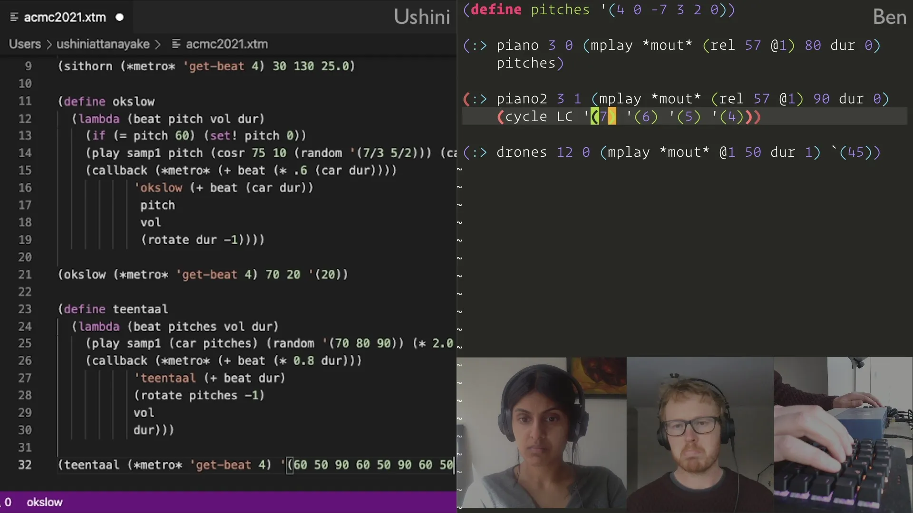
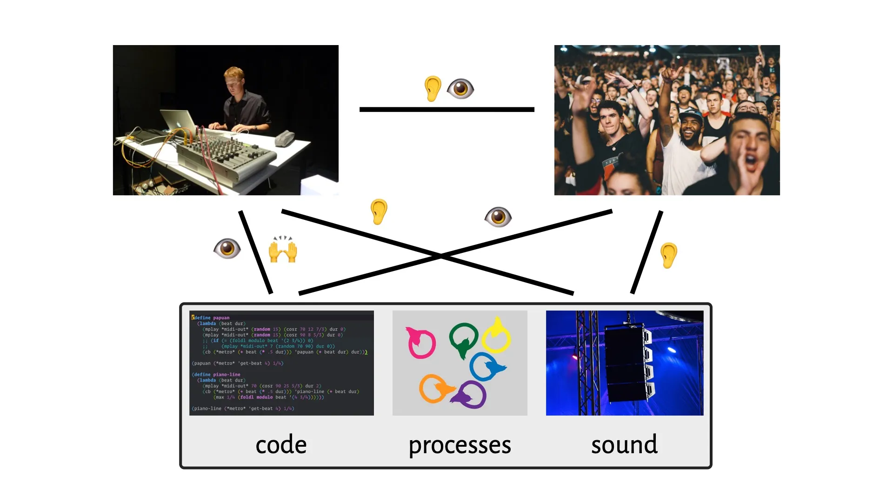
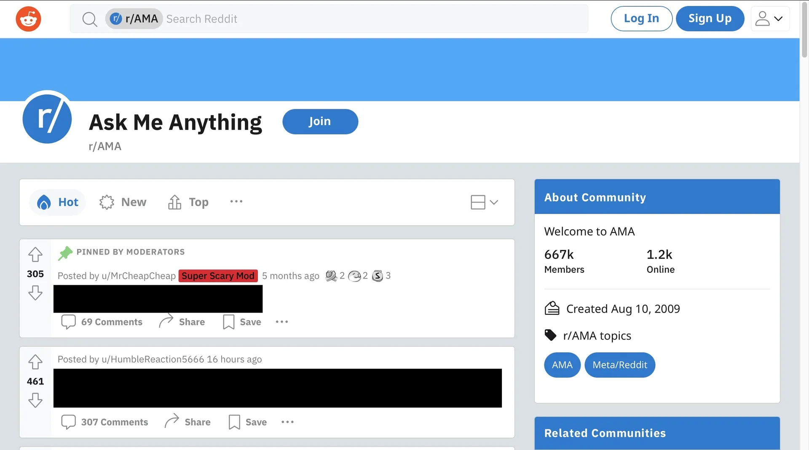
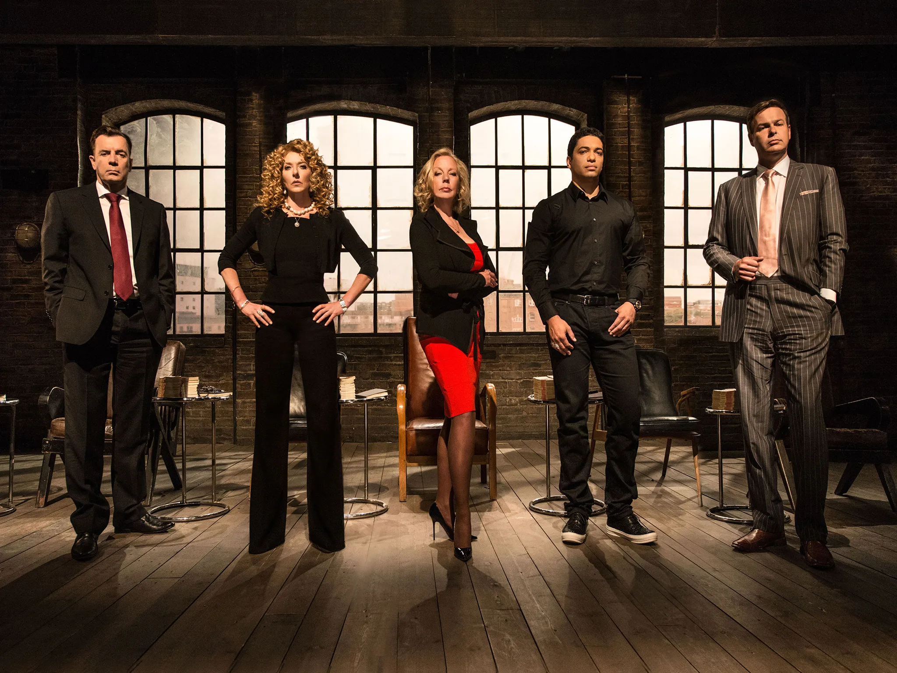

# Feedback in livecoding: cui bono?

Ben Swift, School of Cybernetics

control & communication in the livecoder and the machine

---

{/* _class: centered */}

I'd like to acknowledge and celebrate the First Australians on whose
traditional lands we meet, and pay respect to the elders past and present.

---

{/* _class: centered */}

## who am I?

---

## outline

| Time  | Topic                                              |
| ----- | -------------------------------------------------- |
| 11:10 | intro: the central problem with laptop performance |
| 11:15 | what does cybernetics say?                         |
| 11:20 | livecoding AMA                                     |
| 11:35 | stage designer wanted --- pitch me                 |

---

## intro

I assume you've done the
[pre-reading/watching](/blog/2021/09/13/feedback-in-livecoding-cui-bono/)

---

{/* _class: impact */}

the **central problem** of laptop performance

---

## what do you think oldmate is doing?

---

## what does cybernetics say?

> control & communication in the (livecoding) animal and the machine

what are the flows of information (control & communication)?

and for whose benefit (_cui bono_)?

---

---

## watching the video

what did you **pay attention** to, and why?

what was missing? what _else_ did you want to know before/during/after?

_(5min breakout rooms)_

_hint_: later you'll get to have your say about how these flows could be
improved

---

## I'm a livecoder, AMA

---

## stage designer wanted

set design refers to the design and creation of the sets used in works of
performance art
[(source)](https://www.theartcareerproject.com/careers/set-design/)

pitch time --- what's your vision for my (and [Ushini's](https://ushini.com))
livecoding performance setup?

_(10min breakout rooms, 10min shareback)_

---

## some questions to ponder

- what sensory modalities (sound/visuals/etc) can you use?
- what do K-pop stars/comedians/twitch streamers/DJs do well?
- what feedback should the _performer_ get?
- what information should be _hidden_?
- what's the goal? what state should the system steer towards, and how?
- where are the feedback **loops**?

remember: it's a pitch... you've gotta sell it (with theory!)

---

## pitch time

1--2 min per group

---

## what's next?

a genuine open question for me (and other livecoders) in their creative
practice

if you'd like to help/collaborate/jam, let me know 😊

---

{/* _class: impact */}

questions?
