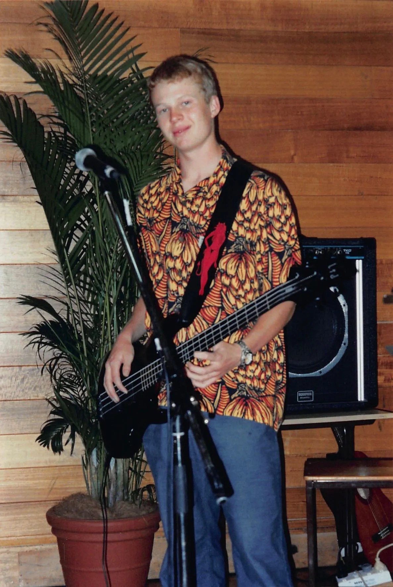
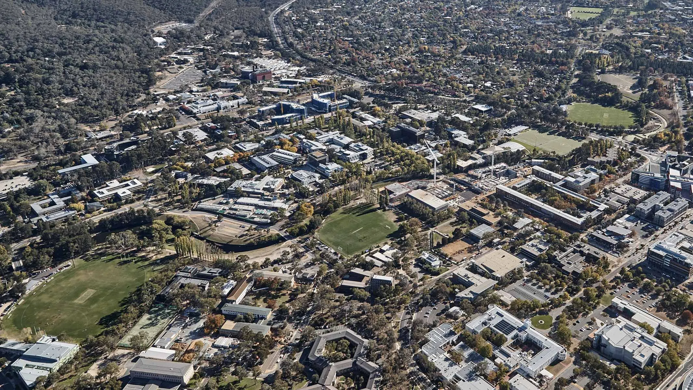
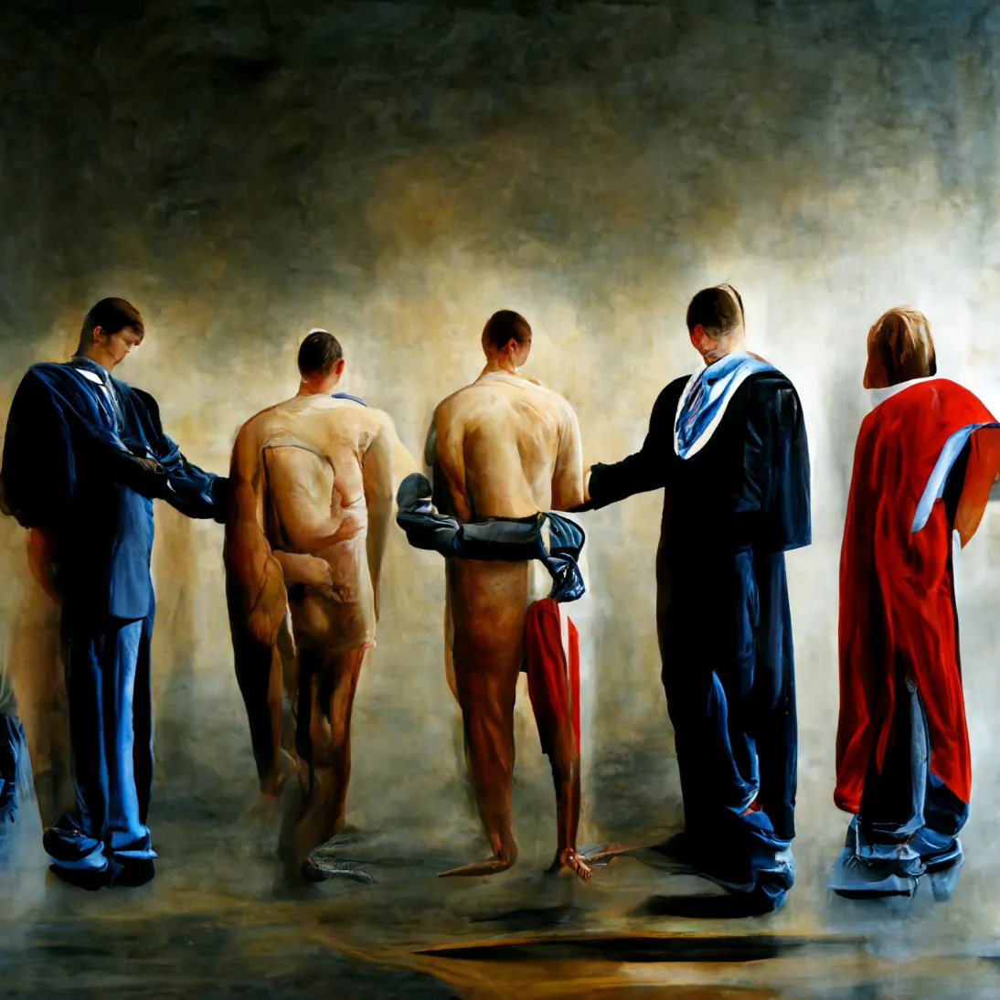
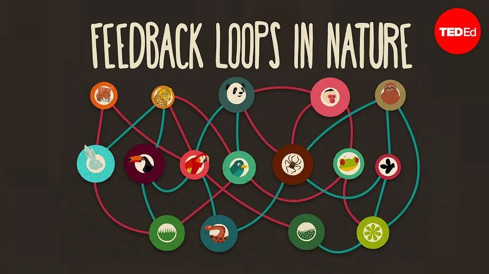
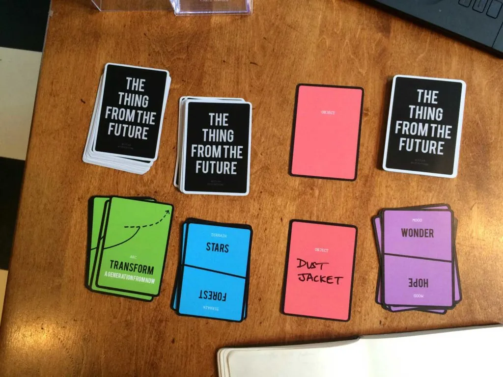
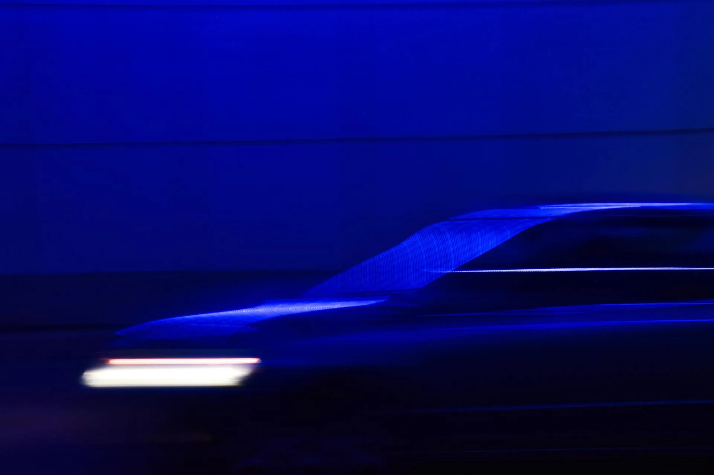
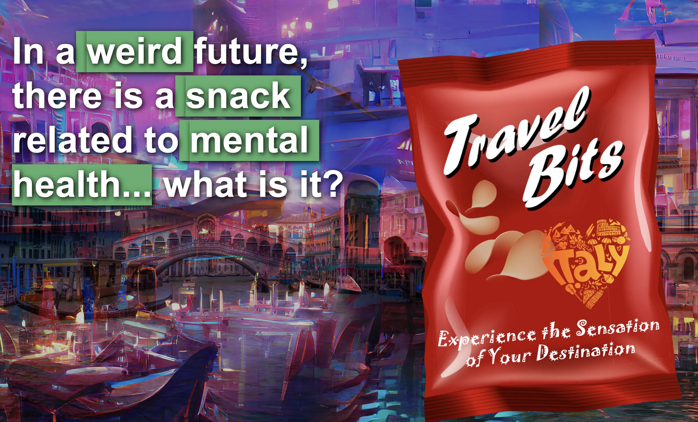
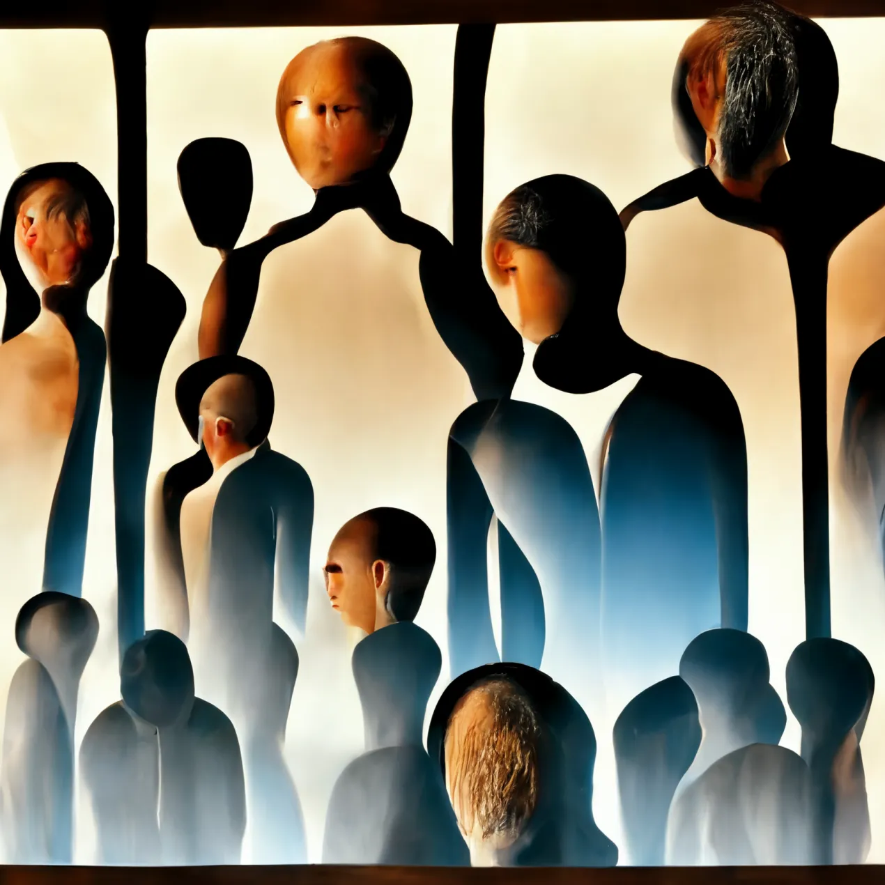

# Futures...

Ben Swift, School of Cybernetics

...of Individuals and Institutions

Wright Hall Leadership Symposium '22

---

{/* _class: centered */}

I'd like to acknowledge and celebrate the First Australians on whose
traditional lands we meet, and pay respect to the elders past and present.

---

{/* _class: impact */}

my journey

---

---

## institutionalised _for sure_

---

## but also an individual path

maths UG → computing PhD → computing academic

I'm now the _Educational Experiences_ lead at the
[School of Cybernetics](https://cybernetics.anu.edu.au/)

---

---

## what is cybernetics?

the study of purposeful, self-regulating systems

---

## futures

---

---

## why futures?

the ways we think about the future affect the systems we build in the
present (both individual and institutional) and vice versa

_futures_ is a set of practices and frameworks to help us think
differently about the future

see the [TED talk](https://www.youtube.com/watch?v=inVZoI1AkC8)

---

## the thing from the future

a _participatory_ keynote

---

## outline

| Time   | Activity                                             |
| ------ | ---------------------------------------------------- |
| 1:30pm | intro                                                |
| 1:45pm | activity: speed futures                              |
| 2:10pm | activity: possible? preferable?                      |
| 2:20pm | discussion: where to conform? where to be empowered? |

---

## speed futures

in pairs, come up with a (post-it sized) description of a **thing from
the future** according to a prompt:

> in a \_\_\_\_ future, there is a \_\_\_\_ related to \_\_\_\_ ... what is it?

---

## example: Travel Bits

a snack with a chemical ingredient that triggers certain sensual events
and effects. In this example the Italy flavour gives you the smells,
tastes and sounds of sitting on the grand canal.

---

---

{/* _class: impact */}

it's **the thing from the future** time

---

## speed futures

in pairs, write a post-it sized description of a **thing from the future**
according to the prompt (one per pair)

5 minutes; leave the completed post-it at your station

---

## possible? preferable?

in your final pair, grab all the post-its left at your station

discuss how possible and preferable each thing is

stick all the post-its on the main whiteboard

---

## where to conform? where to be empowered?

let's see what y'all came up with

---

## the punchline

the ways we think about the future affect the systems we build in the
present (both individual and institutional) and vice versa

_futures_ is a set of practices and frameworks to help us think
differently about the future

---

---

## stay in touch

[ben.swift@anu.edu.au](mailto:ben.swift@anu.edu.au)

[https://cybernetics.anu.edu.au/people/ben-swift/](https://cybernetics.anu.edu.au/people/ben-swift/)

[https://benswift.me](https://benswift.me)
